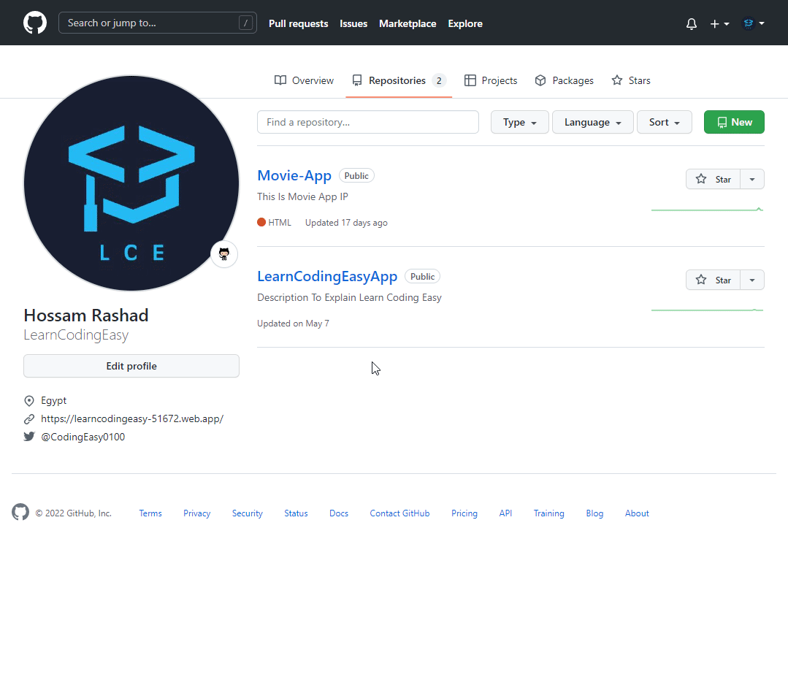
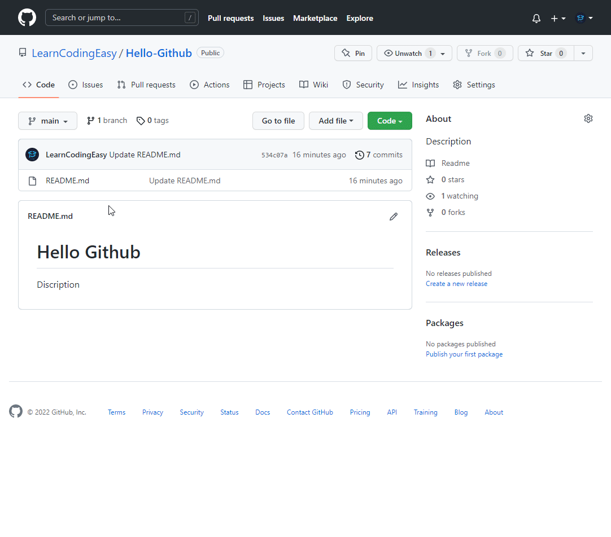

# Github

## 0️⃣1️ Create Repository



## 0️⃣2️⃣ Clone Repository

###### 📁 Git Clone Project

```cmd
git clone https://github.com/LearnCodingEasy/YourRepositoryName.git
```

###### 📁 Project Readmap

```
📦Project
┣ 📁.git
┣ 📜README.md
```



## 0️⃣3️⃣ Create File Gitignore

###### 📝 Create File Gitignore

```text
.gitignore
```

```cmd
touch .gitignore
```

###### 📁 Project Readmap

```
📁Project
┣ 📁 .git
┣ 📜 .gitignore
┣ 📜 README.md
```

###### 🖊️ Write Inside File [gitignore]

```
node_modules/
project_docs/

venv/

.env
*.env
.env.local
.env.production
```

## 0️⃣4️⃣ Review Changes

###### 📋 Review changes and formulate change action

```cmd
git status
```

## 0️⃣5️⃣ Add Changes

###### 📂 Add all new and changed files to the Staging Area.

```
git add *
```

## 0️⃣6️⃣ Commit Changes

###### 💾 This command sends the file from the Staging Area to the Local Repo.

```cmd
git commit -m "Commit Explain Code"
```

## 0️⃣7️⃣ Who You Are

###### Please tell me who you are.

```
git config --global user.name "Hossam Rashad"
```

```
git config --global user.email "learncodingeasy@yahoo.com"
```

## 0️⃣8️⃣ Push Changes

###### 🌐 This command sends files from (Local Repo) to (Remote Repo).

```cmd
git push origin main
```

## 0️⃣9️⃣ Online Project

###### Go To

```
https://dash.cloudflare.com/ead902dc7582ff64dbe07564003280c3/workers-and-pages/create/pages
```

## 1️⃣0️⃣
