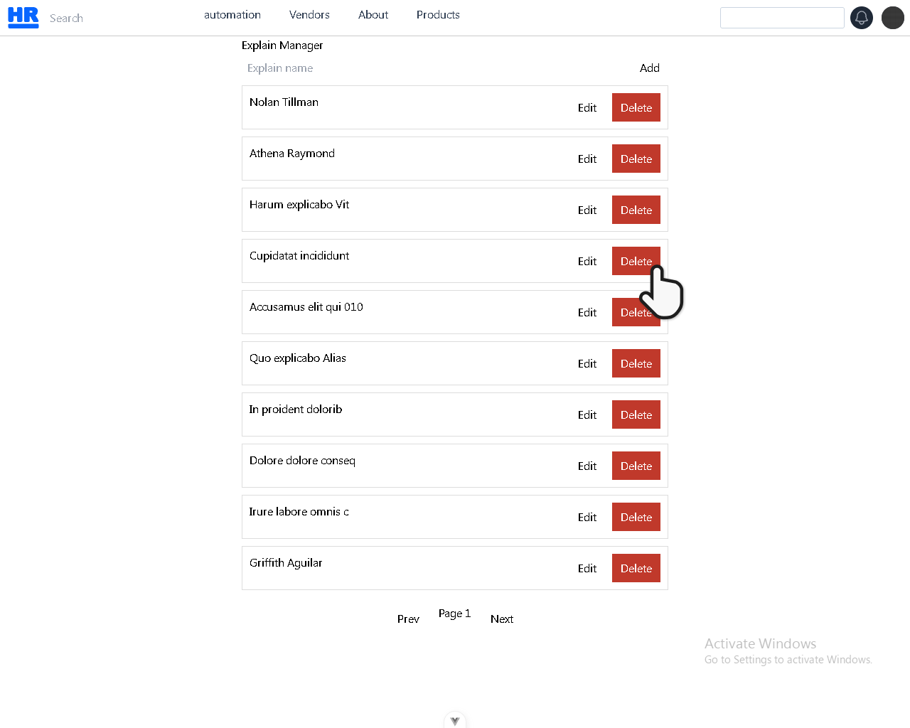
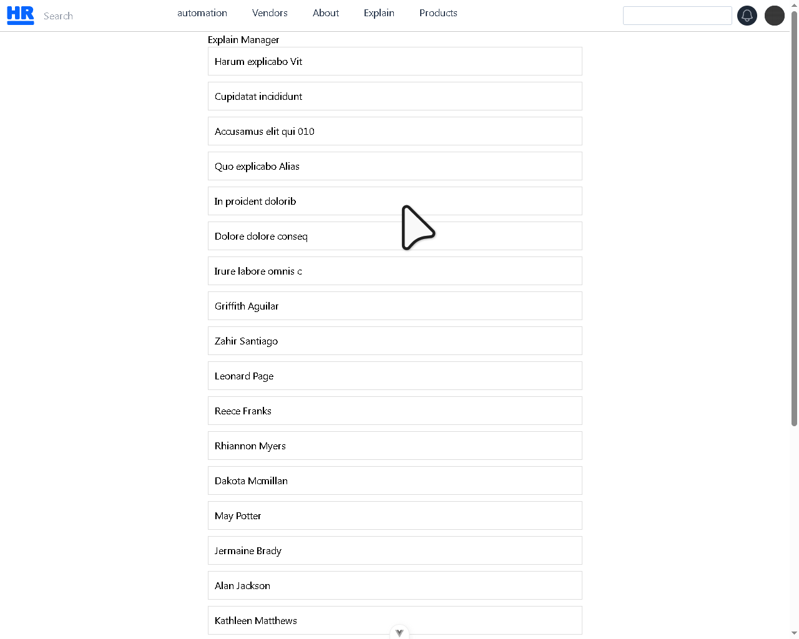
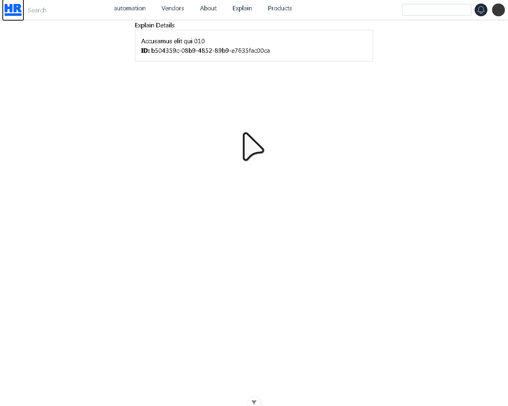

# Vue Django Send Data

## Django Name

### models

```python
"""
models.py
==========
الملف ده هو عقل الداتابيز كله
لازم يعدي من هنا الأول
"""
from django.db import models
import uuid
# ==================================================
# 1️⃣ Explain
# ==================================================
class Explain(models.Model):
    # ___________________
    # حقل يتم تعبئة تلقائي
    # ___________________
    # ====================== 🆔 IDs ======================
    id = models.UUIDField(primary_key=True, default=uuid.uuid4, editable=False)
    slug = models.SlugField( max_length=255, editable=False, unique=True, blank=True)

    # ___________________
    # حقل يتم تعبئة من المستخدام
    # ___________________
    # ====================== ℹ️ Basic Info ======================
    # الاسم اللي هيظهر في الواجهة
    name = models.CharField(max_length=100)

    # Slug Auto Save
    def save(self, *args, **kwargs):
        if not self.slug:
            base_slug = slugify(self.name)
            slug = base_slug
            counter = 1
            while Explain.objects.filter(slug=slug).exists():
                slug = f"{base_slug}-{counter}"
                counter += 1
            self.slug = slug
        super().save(*args, **kwargs)

    def __str__(self):
        return self.name


```

### serializers

```python
# serializers.py
from rest_framework import serializers
from .models import Explain
# ==================================================
# 1️⃣ Explain
# ==================================================
class ExplainSerializer(serializers.ModelSerializer):
    class Meta:
        model = Explain
        # fields = "__all__"
        fields = ['id', 'name', ]
```

### views

```python
# views.py

from rest_framework import viewsets, status
from rest_framework.decorators import action
from rest_framework.response import Response
from rest_framework.generics import ListAPIView
from rest_framework.viewsets import ReadOnlyModelViewSet
from django.utils import timezone
from .models import Explain
from .serializers import ExplainSerializer
# ==================================================
# 1️⃣ Explain
# ==================================================
class ExplainViewSet(viewsets.ModelViewSet):
    """
    🖥️ ViewSet لإدارة البرامج وتشغيلها وتتبع حالتها
    """
    queryset = Explain.objects.all()
    serializer_class = ExplainSerializer

```

### urls

```python
# urls.py
from rest_framework.routers import DefaultRouter
from .views import ExplainViewSet
router = DefaultRouter()
router.register("explains", ProgramViewSet, basename="explains")
urlpatterns = router.urls
```

### admin

```python
# admin.py
# 🛠️ Django استيراد أدوات إدارة
from django.contrib import admin
# 🌐 (Model) استيراد نموذج
from .models import Explain
# 🖥️ في لوحة الإدارة Website تسجيل نموذج
admin.site.register(Explain)
```

## Vue Name

### Services Api

```js
// frontend_vue\src\services\api.js

import axios from "axios";
// Create axios instance with base configuration
// إعداد الاتصال بالسيرفر
const api = axios.create({
  baseURL: "http://localhost:8000/api/",
  timeout: 30000,
  // withCredentials: true,
  headers: {
    "Content-Type": "application/json",
  },
});
// Request interceptor for adding auth tokens (if needed later)
api.interceptors.request.use(
  (config) => {
    // Add auth token if available
    const token = localStorage.getItem("user.access");
    console.log("🔥 Token being sent: ", token);
    if (token) {
      config.headers.Authorization = `Bearer ${token}`;
    }
    return config;
  },
  (error) => {
    return Promise.reject(error);
  }
);
// Response interceptor for handling errors
// التعامل مع الأخطاء
api.interceptors.response.use(
  (response) => response,
  (error) => {
    if (error.response?.status === 401) {
      // Handle unauthorized access
      localStorage.removeItem("auth_token");
      // Redirect to login if needed
    }
    return Promise.reject(error);
  }
);

export default api;
```

### Services Data

```js
// src/services/explainsService.js
import api from "./api";

const explainService = {
  /**
    // Params
    list(params = {}) {
      return api.get('/automation/explains/', params)
    },
    list() {
      return api.get('/automation/explains/')
    },
  */
  // All List
  async list() {
    const res = await api.get("/automation/explains/");
    console.log("API DATA 👉", res.data);
    return res.data;
  },
  get(id) {
    return api.get(`/automation/explains/${id}/`);
  },
  create(data) {
    return api.post("/automation/explains/", data, {
      headers: {
        "Content-Type": "multipart/form-data",
      },
    });
  },
  update(id, data) {
    return api.put(`/automation/explains/${id}/`, data);
  },
  delete(id) {
    return api.delete(`/automation/explains/${id}/`);
  },
};

export default explainService;
```

### All Data one page

```html
<template>
  <div class="explain-page">
    <h2>Explain Manager</h2>
    <!-- Toast -->
    <div v-if="toast.show" :class="['toast', toast.type]">
      {{ toast.message }}
    </div>
    <!-- Form -->
    <div class="card">
      <input v-model="form.name" placeholder="Explain name" />
      <button @click="submit" :disabled="loading">
        {{ editMode ? 'Update' : 'Add' }}
      </button>
      <button v-if="editMode" @click="resetForm" class="cancel">Cancel</button>
    </div>
    <!-- Validation -->
    <p v-if="errors.name" class="error">{{ errors.name }}</p>
    <!-- Loader -->
    <div v-if="loading" class="loader">Loading...</div>
    <!-- List -->
    <div v-else class="list">
      <div class="item" v-for="item in explains" :key="item.id">
        <span>{{ item.name }}</span>
        <div class="actions">
          <button @click="editItem(item)">Edit</button>
          <button @click="remove(item.id)" class="danger">Delete</button>
        </div>
      </div>
    </div>
    <!-- Pagination -->
    <div class="pagination">
      <button @click="prevPage" :disabled="page === 1">Prev</button>
      <span>Page {{ page }}</span>
      <button @click="nextPage" :disabled="!hasNext">Next</button>
    </div>
  </div>
</template>
```

```js
<script setup>
import { ref, onMounted } from 'vue'
import explainService from '@/services/explainsService'
// =======================
// State
// =======================
const explains = ref([])
const loading = ref(false)
const page = ref(1)
const pageSize = 10
const hasNext = ref(false)
const editMode = ref(false)
const currentId = ref(null)
const form = ref({
  name: '',
})
const errors = ref({
  name: '',
})
const toast = ref({
  show: false,
  message: '',
  type: 'success', // success | error
})
// =======================
// Helpers
// =======================
const showToast = (message, type = 'success') => {
  toast.value = { show: true, message, type }
  setTimeout(() => (toast.value.show = false), 3000)
}
const validate = () => {
  errors.value.name = ''
  if (!form.value.name.trim()) {
    errors.value.name = 'Name is required'
    return false
  }
  return true
}
// =======================
// API
// =======================
const fetchExplains = async () => {
  loading.value = true
  try {
    const res = await explainService.list({
      params: {
        page: page.value,
        page_size: pageSize,
      },
    })
    // DRF Pagination support
    explains.value = res.data.results ?? res.data
    hasNext.value = !!res.data.next
  } catch (err) {
    console.log('err: ', err)
    showToast('Failed to load data', 'error')
  } finally {
    loading.value = false
  }
}
const submit = async () => {
  if (!validate()) return
  loading.value = true
  try {
    if (editMode.value) {
      await explainService.update(currentId.value, form.value)
      showToast('Updated successfully')
    } else {
      await explainService.create(form.value)
      showToast('Created successfully')
    }
    resetForm()
    fetchExplains()
  } catch (err) {
    console.log('err: ', err)
    showToast('Operation failed', 'error')
  } finally {
    loading.value = false
  }
}
const editItem = (item) => {
  editMode.value = true
  currentId.value = item.id
  form.value.name = item.name
}
const remove = async (id) => {
  if (!confirm('Delete this item?')) return
  loading.value = true
  try {
    await explainService.delete(id)
    showToast('Deleted successfully')
    fetchExplains()
  } catch {
    showToast('Delete failed', 'error')
  } finally {
    loading.value = false
  }
}
const resetForm = () => {
  editMode.value = false
  currentId.value = null
  form.value.name = ''
  errors.value.name = ''
}
// =======================
// Pagination
// =======================
const nextPage = () => {
  page.value++
  fetchExplains()
}
const prevPage = () => {
  page.value--
  fetchExplains()
}
// =======================
// Lifecycle
// =======================
onMounted(fetchExplains)
</script>

```

```css
<style scoped>
.explain-page {
  max-width: 600px;
  margin: auto;
}
.card {
  display: flex;
  gap: 10px;
  margin-bottom: 5px;
}
input {
  flex: 1;
  padding: 8px;
}
button {
  padding: 8px 12px;
}
.cancel {
  background: #aaa;
}
.error {
  color: #c0392b;
  font-size: 14px;
}
.loader {
  text-align: center;
  margin: 20px;
}
.list {
  display: flex;
  flex-direction: column;
  gap: 10px;
}
.item {
  display: flex;
  justify-content: space-between;
  padding: 10px;
  border: 1px solid #ddd;
}
.actions {
  display: flex;
  gap: 10px;
}
.danger {
  background: #c0392b;
  color: white;
}
.pagination {
  display: flex;
  justify-content: center;
  gap: 15px;
  margin-top: 20px;
}
/* Toast */
.toast {
  position: fixed;
  top: 20px;
  right: 20px;
  padding: 12px 20px;
  color: white;
  border-radius: 5px;
}
.toast.success {
  background: #27ae60;
}
.toast.error {
  background: #c0392b;
}
</style>
```



### List

```html
<!-- All Data -->
<template>
  <div class="explain-page">
    <h2>Explain Manager</h2>
    <div class="list">
      <div class="item" v-for="item in explains" :key="item.id">
        <RouterLink :to="{ name: 'explain-details', params: { id: item.id } }">
          <span>{{ item.name }}</span>
        </RouterLink>
      </div>
    </div>
  </div>
</template>
```

```js
<script setup>
import { ref, onMounted } from 'vue'
import explainService from '@/services/explainsService'
const explains = ref([])
const fetchExplains = async () => {
  try {
    const data = await explainService.list()
    console.log('STORE DATA 👉', data)
    explains.value = data
  } catch (err) {
    console.log(err)
  }
}
onMounted(fetchExplains)
</script>
```

```css
<style scoped>
.explain-page {
  max-width: 600px;
  margin: auto;
}
.card {
  display: flex;
  gap: 10px;
  margin-bottom: 5px;
}
.list {
  display: flex;
  flex-direction: column;
  gap: 10px;
}
.item {
  display: flex;
  justify-content: space-between;
  padding: 10px;
  border: 1px solid #ddd;
}
</style>
```



### Explain Details

```html
<template>
  <div class="explain-page">
    <h2>Explain Details</h2>
    <!-- Loading -->
    <div v-if="loading" class="loading">Loading...</div>
    <!-- Data -->
    <div v-else-if="explain" class="card">
      <h3>{{ explain.name }}</h3>
      <p><strong>ID:</strong> {{ explain.id }}</p>
    </div>
    <!-- Not Found -->
    <div v-else class="empty">Explain not found</div>
  </div>
</template>
```

```js
<script setup>
import { ref, onMounted, watch } from 'vue'
import { useRoute } from 'vue-router'
import explainService from '@/services/explainsService'
const route = useRoute()
const explain = ref(null)
const loading = ref(true)
const fetchExplain = async () => {
  try {
    const { id } = route.params
    const data = await explainService.get(id)
    console.log('DETAIL DATA 👉', data)
    explain.value = data.data
  } catch (err) {
    console.log(err)
  } finally {
    loading.value = false
  }
}
watch(() => route.params.id, fetchExplain)
onMounted(fetchExplain)
</script>
```

```css
<style scoped>
.explain-page {
  max-width: 600px;
  margin: auto;
}
.card {
  padding: 15px;
  border: 1px solid #ddd;
}
.loading {
  text-align: center;
}
.empty {
  color: #999;
  text-align: center;
}
</style>
```



### Create Data Name

```html
<template>
  <div class="explain-page">
    <h2>Explain Create</h2>
    <div class="card">
      <input v-model="form.name" placeholder="Explain name" />
      <button @click="submit">Add</button>
    </div>
  </div>
</template>
```

```js
<script setup>
import { ref } from 'vue'
import explainService from '@/services/explainsService'

// =======================
// State
// =======================
const form = ref({
  name: '',
})

// =======================
// API
// =======================
const submit = async () => {
  try {
    const formData = new FormData()
    // =================
    // Text
    // =================
    formData.append('name', form.value.name)
    await explainService.create(formData)
  } catch (err) {
    console.log('err: ', err)
  } finally {
    console.log(`Data Created ✅`)
  }
}
</script>
```

```css
<style scoped>
.explain-page {
  max-width: 600px;
  margin: auto;
}
.card {
  padding: 15px;
  border: 1px solid #ddd;
  display: grid;
  grid-template-columns: repeat(auto-fill, minmax(200px, 1fr));
}
</style>
```

### Edit Data Name

```html
<template>
  <div class="explain-page">
    <h2>Explain Edit</h2>
    <div class="card">
      <input v-model="form.name" placeholder="Explain name" />
      <button @click="submit">Update</button>
    </div>
  </div>
</template>
```

```js
<script setup>
import { ref, onMounted } from 'vue'
import { useRoute, useRouter } from 'vue-router'
import explainService from '@/services/explainsService'
// =======================
// Router
// =======================
const route = useRoute()
const router = useRouter()
// =======================
// State
// =======================
const currentId = ref(null)
const form = ref({
  name: '',
})
// =======================
// Get Explain By ID
// =======================
const getExplain = async () => {
  try {
    currentId.value = route.params.id
    const res = await explainService.get(currentId.value)
    form.value.name = res.data.name
  } catch (err) {
    console.log('Get error:', err)
  }
}
// =======================
// Update
// =======================
const submit = async () => {
  try {
    const formData = new FormData()
    // =================
    // Text
    // =================
    formData.append('name', form.value.name)

    await explainService.update(currentId.value, formData)
    console.log('Updated Successfully')
    // لو حابب ترجع لليست
    router.push({ name: 'explains' })
  } catch (err) {
    console.log('Update error:', err)
  }
}
// =======================
// Lifecycle
// =======================
onMounted(() => {
  getExplain()
})
</script>
```

### Delete Data

```html
<button type="button" @click="remove(item.id)">Delete</button>
```

```html
<!-- All Data -->
<template>
  <div class="explain-page">
    <h2>Explain Manager</h2>
    <div class="list">
      <div class="item" v-for="item in explains" :key="item.id">
        <RouterLink :to="{ name: 'explain-details', params: { id: item.id } }">
          <span>{{ item.name }}</span>
        </RouterLink>
        <button type="button" @click="remove(item.id)">Delete</button>
      </div>
    </div>
  </div>
</template>
```

```js
import explainService from "@/services/explainsService";

const remove = async (id) => {
  if (!confirm("Delete this item?")) return;
  try {
    await explainService.delete(id);
  } catch {
    console.log(`No`);
  } finally {
    console.log(`Yes`);
  }
};
```

```js
<script setup>
import { ref, onMounted } from 'vue'
import explainService from '@/services/explainsService'

// =======================
// State
// =======================
const explains = ref([])
const toast = ref({
  show: false,
  message: '',
  type: 'success', // success | error
})

// =======================
// Helpers
// =======================
const showToast = (message, type = 'success') => {
  toast.value = { show: true, message, type }
  setTimeout(() => (toast.value.show = false), 3000)
}

// =======================
// API
// =======================
const fetchExplains = async () => {
  try {
    const data = await explainService.list()
    console.log('STORE DATA 👉', data)
    explains.value = data
  } catch (err) {
    console.log(err)
  }
}
const remove = async (id) => {
  if (!confirm('Delete this item?')) return
  try {
    await explainService.delete(id)
    showToast('Delete successfully')
    fetchExplains()
  } catch {
    console.log(`No`)
  } finally {
    console.log(`Yes`)
  }
}
onMounted(fetchExplains)
</script>
```

### Toast

```html
<div v-if="toast.show" :class="['toast', toast.type]">{{ toast.message }}</div>
```

```html
<template>
  <div class="explain-page">
    <h2>Explain Create</h2>
    <div class="card">
      <input v-model="form.name" placeholder="Explain name" />
      <button @click="submit">Add</button>
    </div>
    <div v-if="toast.show" :class="['toast', toast.type]">
      {{ toast.message }}
    </div>
  </div>
</template>
```

```js
// =======================
// State
// =======================
const toast = ref({
  show: false,
  message: "",
  type: "success", // success | error
});
// =======================
// Helpers
// =======================
const showToast = (message, type = "success") => {
  toast.value = { show: true, message, type };
  setTimeout(() => (toast.value.show = false), 3000);
};
// =======================
// API
// =======================
const submit = async () => {
  try {
    if (editMode.value) {
      await explainService.update(currentId.value, form.value);
      showToast("Updated successfully");
    } else {
      await explainService.create(form.value);
      showToast("Created successfully");
    }
  } catch (err) {
    console.log("err: ", err);
    showToast("Operation failed", "error");
  } finally {
    console.log(`Yes`);
  }
};
```

```js
<script setup>
import { ref } from 'vue'
import explainService from '@/services/explainsService'

// =======================
// State
// =======================
const form = ref({
  name: '',
})
const toast = ref({
  show: false,
  message: '',
  type: 'success', // success | error
})
// =======================
// Helpers
// =======================
const showToast = (message, type = 'success') => {
  toast.value = { show: true, message, type }
  setTimeout(() => (toast.value.show = false), 3000)
}
// =======================
// API
// =======================
const submit = async () => {
  try {
    if (form.value) {
      showToast('Created successfully')
    }
  } catch (err) {
    showToast('Operation failed', 'error')
  } finally {
    showToast('Data Created successfully ✅')
    console.log(``)
  }
}
</script>
```

```css
/* Toast */
.toast {
  position: fixed;
  top: 20px;
  right: 20px;
  padding: 12px 20px;
  color: white;
  border-radius: 5px;
  z-index: 1000;
}
.toast.success {
  background: #27ae60;
}
.toast.error {
  background: #c0392b;
}
```

### Loading Data

```html
<div v-if="loading" class="loader">Loading...</div>
```

```js
<script setup>
// =======================
// State
// =======================
const loading = ref(false)
// =======================
// API
// =======================
const submit = async () => {
  loading.value = true
  try {
    if (form.value) {
      await explainService.create(form.value)
      showToast('Created successfully')
    }
  } catch (err) {
    showToast('Operation failed', 'error')
  } finally {
    loading.value = false
  }
}
</script>

```

```css
.loader {
  text-align: center;
  margin: 20px;
}
```

### All Data

```html

```

```js

```

```css

```

## Django Description

### models

```python
    description = models.TextField(null=True, blank=True)

```

```python
"""
models.py
==========
الملف ده هو عقل الداتابيز كله
لازم يعدي من هنا الأول
"""
from django.db import models
import uuid
# ==================================================
# 1️⃣ Explain
# ==================================================
class Explain(models.Model):
    # ====================== 🆔 IDs ======================
    id = models.UUIDField(primary_key=True, default=uuid.uuid4, editable=False)
    # ====================== ℹ️ Basic Info ======================
    # الاسم اللي هيظهر في الواجهة
    name = models.CharField(max_length=100)
    description = models.TextField(null=True, blank=True)

    def __str__(self):
        return self.name

```

### serializers

```python
# serializers.py
from rest_framework import serializers
from .models import Explain
# ==================================================
# 1️⃣ Explain
# ==================================================
class ExplainSerializer(serializers.ModelSerializer):
    class Meta:
        model = Explain
        # fields = "__all__"
        fields = ['id', 'name', 'description',]
```

### views

```python
# views.py

from rest_framework import viewsets, status
from rest_framework.decorators import action
from rest_framework.response import Response
from rest_framework.generics import ListAPIView
from rest_framework.viewsets import ReadOnlyModelViewSet
from django.utils import timezone
from .models import Explain
from .serializers import ExplainSerializer
# ==================================================
# 1️⃣ Explain
# ==================================================
class ExplainViewSet(viewsets.ModelViewSet):
    """
    🖥️ ViewSet لإدارة البرامج وتشغيلها وتتبع حالتها
    """
    queryset = Explain.objects.all()
    serializer_class = ExplainSerializer

```

### urls

```python
# urls.py
from rest_framework.routers import DefaultRouter
from .views import ExplainViewSet
router = DefaultRouter()
router.register("explains", ProgramViewSet, basename="explains")
urlpatterns = router.urls
```

### admin

```python
# admin.py
# 🛠️ Django استيراد أدوات إدارة
from django.contrib import admin
# 🌐 (Model) استيراد نموذج
from .models import Explain
# 🖥️ في لوحة الإدارة Website تسجيل نموذج
admin.site.register(Explain)
```

## Vue Description

```html
<textarea
  v-model="form.description"
  name="form.description"
  id=""
  cols="10"
  rows="10"
  placeholder="Explain Description"
></textarea>
```

```js
  description: '',
```

```html
<template>
  <div class="explain-page">
    <h2>Explain Create</h2>
    <div class="card">
      <input v-model="form.name" placeholder="Explain name" />
      <textarea
        v-model="form.description"
        name="form.description"
        id=""
        cols="10"
        rows="10"
        placeholder="Explain Description"
      ></textarea>
      <button @click="submit">Add</button>
    </div>
    <div v-if="toast.show" :class="['toast', toast.type]">
      {{ toast.message }}
    </div>
  </div>
</template>
```

```js
<script setup>
import { ref } from 'vue'
import explainService from '@/services/explainsService'

// =======================
// State
// =======================
const form = ref({
  name: '',
  description: '',
})
const toast = ref({
  show: false,
  message: '',
  type: 'success', // success | error
})
// =======================
// Helpers
// =======================
const showToast = (message, type = 'success') => {
  toast.value = { show: true, message, type }
  setTimeout(() => (toast.value.show = false), 3000)
}
// =======================
// API
// =======================
const submit = async () => {
  try {
    if (form.value) {
      await explainService.create(form.value)
      showToast('Created successfully')
    }
  } catch (err) {
    console.log('err: ', err)
    showToast('Operation failed', 'error')
  } finally {
    console.log(`Data Created ✅`)
  }
}
</script>
```

## Django slug

### models

```python
    slug = models.SlugField(max_length=255, editable=False, unique=True, blank=True)

    def save(self, *args, **kwargs):
        if not self.slug:
            base_slug = slugify(self.name)
            slug = base_slug
            counter = 1
            while Explain.objects.filter(slug=slug).exists():
                slug = f"{base_slug}-{counter}"
                counter += 1
            self.slug = slug
        super().save(*args, **kwargs)
```

```python
"""
models.py
==========
الملف ده هو عقل الداتابيز كله
لازم يعدي من هنا الأول
"""

from django.db import models
from django.conf import settings
import uuid
# App User
from users_accounts.models import User
from django.utils.text import slugify


# ==================================================
# 1️⃣ Explain
# ==================================================


class Explain(models.Model):
    # ___________________
    # حقل يتم تعبئة تلقائي
    # ___________________
    # ====================== 🆔 IDs ======================
    id = models.UUIDField(primary_key=True, default=uuid.uuid4, editable=False)

    # ___________________
    # حقل يتم تعبئة من المستخدام
    # ___________________

    # ====================== ℹ️ Basic Info ======================
    name = models.CharField(max_length=100)

    description = models.TextField(null=True, blank=True)

    slug = models.SlugField(max_length=255, editable=False, unique=True, blank=True)

    def save(self, *args, **kwargs):
        if not self.slug:
            base_slug = slugify(self.name)
            slug = base_slug
            counter = 1
            while Explain.objects.filter(slug=slug).exists():
                slug = f"{base_slug}-{counter}"
                counter += 1
            self.slug = slug
        super().save(*args, **kwargs)

    def __str__(self):
        return self.name


```

### serializers

```python
# serializers.py
from rest_framework import serializers
from .models import Explain
# ==================================================
# 1️⃣ Explain
# ==================================================
class ExplainSerializer(serializers.ModelSerializer):
    class Meta:
        model = Explain
        # fields = "__all__"
        fields = ['id', 'name', 'description', 'slug',]
```

## Django Email

### models

```python
email = models.EmailField(unique=True)
```

```python
"""
models.py
==========
الملف ده هو عقل الداتابيز كله
لازم يعدي من هنا الأول
"""

from django.db import models
from django.conf import settings
import uuid
# App User
from users_accounts.models import User
from django.utils.text import slugify


# ==================================================
# 1️⃣ Explain
# ==================================================


class Explain(models.Model):
    # ___________________
    # حقل يتم تعبئة تلقائي
    # ___________________
    # ====================== 🆔 IDs ======================
    id = models.UUIDField(primary_key=True, default=uuid.uuid4, editable=False)
    slug = models.SlugField(max_length=255, editable=False, unique=True, blank=True)

    # ___________________
    # حقل يتم تعبئة من المستخدام
    # ___________________

    # ====================== ℹ️ Basic Info ======================
    name = models.CharField(max_length=100)
    description = models.TextField(null=True, blank=True)
    email = models.EmailField(unique=True)

    # Slug Auto Save
    def save(self, *args, **kwargs):
        if not self.slug:
            base_slug = slugify(self.name)
            slug = base_slug
            counter = 1
            while Explain.objects.filter(slug=slug).exists():
                slug = f"{base_slug}-{counter}"
                counter += 1
            self.slug = slug
        super().save(*args, **kwargs)


    def __str__(self):
        return self.name
```

### serializers

```python
# backend_django\automation\serializers.py
from rest_framework import serializers
from .models import Explain
# ==================================================
# 1️⃣ Explain
# ==================================================


class ExplainSerializer(serializers.ModelSerializer):
    class Meta:
        model = Explain
        # fields = "__all__"
        fields = ['id', 'name', 'description', 'slug', 'email',]
```

## Vue Email

```html
<input type="email" v-model="form.email" />
```

```js
email:'',
```

```html
<template>
  <div class="explain-page">
    <h2>Explain Create</h2>
    <div class="card">
      <input v-model="form.name" placeholder="Explain name" />
      <textarea
        v-model="form.description"
        name="form.description"
        id=""
        cols="10"
        rows="10"
        placeholder="Explain Description"
      ></textarea>
      <input type="email" v-model="form.email" />

      <button @click="submit">Add</button>
    </div>
    <div v-if="toast.show" :class="['toast', toast.type]">
      {{ toast.message }}
    </div>
  </div>
</template>
```

```js

<script setup>
import { ref } from 'vue'
import explainService from '@/services/explainsService'

// =======================
// State
// =======================
const form = ref({
  name: '',
  description: '',
  email:'',
})
const toast = ref({
  show: false,
  message: '',
  type: 'success', // success | error
})
// =======================
// Helpers
// =======================
const showToast = (message, type = 'success') => {
  toast.value = { show: true, message, type }
  setTimeout(() => (toast.value.show = false), 3000)
}
// =======================
// API
// =======================
const submit = async () => {
  try {
    if (form.value) {
      await explainService.create(form.value)
      showToast('Created successfully')
    }
  } catch (err) {
    console.log('err: ', err)
    showToast('Operation failed', 'error')
  } finally {
    console.log(`Data Created ✅`)
  }
}
</script>
```

## Django Url

### models

```python
    url = models.URLField( max_length=255, blank=True, null=True, default="",)
```

```python
"""
models.py
==========
الملف ده هو عقل الداتابيز كله
لازم يعدي من هنا الأول
"""

from django.db import models
from django.conf import settings
import uuid
# App User
from users_accounts.models import User
from django.utils.text import slugify


# ==================================================
# 1️⃣ Explain
# ==================================================


class Explain(models.Model):
    # ___________________
    # حقل يتم تعبئة تلقائي
    # ___________________
    # ====================== 🆔 IDs ======================
    id = models.UUIDField(primary_key=True, default=uuid.uuid4, editable=False)
    slug = models.SlugField(max_length=255, editable=False, unique=True, blank=True)

    # ___________________
    # حقل يتم تعبئة من المستخدام
    # ___________________

    # ====================== ℹ️ Basic Info ======================
    name = models.CharField(max_length=100)
    description = models.TextField(null=True, blank=True)
    email = models.EmailField(unique=True)
    url = models.URLField( max_length=255, blank=True, null=True, default="",)

    # Slug Auto Save
    def save(self, *args, **kwargs):
        if not self.slug:
            base_slug = slugify(self.name)
            slug = base_slug
            counter = 1
            while Explain.objects.filter(slug=slug).exists():
                slug = f"{base_slug}-{counter}"
                counter += 1
            self.slug = slug
        super().save(*args, **kwargs)


    def __str__(self):
        return self.name
```

### serializers

```python
# serializers.py
from rest_framework import serializers
from .models import Explain
# ==================================================
# 1️⃣ Explain
# ==================================================
class ExplainSerializer(serializers.ModelSerializer):
    class Meta:
        model = Explain
        # fields = "__all__"
        fields = ['id', 'name', 'description', 'slug', 'email', 'url',]
```

## Vue Url

```html
<input type="url" v-model="form.url" />
```

```js
url: '',
```

```html
<template>
  <div class="explain-page">
    <h2>Explain Create</h2>
    <div class="card">
      <input v-model="form.name" placeholder="Explain name" />
      <textarea
        v-model="form.description"
        name="form.description"
        id=""
        cols="10"
        rows="10"
        placeholder="Explain Description"
      ></textarea>
      <input type="email" v-model="form.email" />
      <input type="url" v-model="form.url" />

      <button @click="submit">Add</button>
    </div>
    <div v-if="toast.show" :class="['toast', toast.type]">
      {{ toast.message }}
    </div>
  </div>
</template>
```

```js
<script setup>
import { ref } from 'vue'
import explainService from '@/services/explainsService'

// =======================
// State
// =======================
const form = ref({
  name: '',
  description: '',
  email: '',
  url: '',
})
const toast = ref({
  show: false,
  message: '',
  type: 'success', // success | error
})
// =======================
// Helpers
// =======================
const showToast = (message, type = 'success') => {
  toast.value = { show: true, message, type }
  setTimeout(() => (toast.value.show = false), 3000)
}
// =======================
// API
// =======================
const submit = async () => {
  try {
    if (form.value) {
      await explainService.create(form.value)
      showToast('Created successfully')
    }
  } catch (err) {
    console.log('err: ', err)
    showToast('Operation failed', 'error')
  } finally {
    console.log(`Data Created ✅`)
  }
}
</script>
```

## Django IntegerField

### models

```python
price = models.IntegerField(default=0)
```

```python
"""
models.py
==========
الملف ده هو عقل الداتابيز كله
لازم يعدي من هنا الأول
"""

from django.db import models
from django.conf import settings
import uuid
# App User
from users_accounts.models import User
from django.utils.text import slugify


# ==================================================
# 1️⃣ Explain
# ==================================================


class Explain(models.Model):
    # ___________________
    # حقل يتم تعبئة تلقائي
    # ___________________
    # ====================== 🆔 IDs ======================
    id = models.UUIDField(primary_key=True, default=uuid.uuid4, editable=False)
    slug = models.SlugField(
        max_length=255, editable=False, unique=True, blank=True)

    # ___________________
    # حقل يتم تعبئة من المستخدام
    # ___________________

    # ====================== ℹ️ Basic Info ======================
    name = models.CharField(max_length=100)
    description = models.TextField(null=True, blank=True)
    email = models.EmailField(unique=True)
    url = models.URLField(max_length=255, blank=True, null=True, default="",)

    #
    price = models.IntegerField(default=0)


    # Slug Auto Save

    def save(self, *args, **kwargs):
        if not self.slug:
            base_slug = slugify(self.name)
            slug = base_slug
            counter = 1
            while Explain.objects.filter(slug=slug).exists():
                slug = f"{base_slug}-{counter}"
                counter += 1
            self.slug = slug
        super().save(*args, **kwargs)

    def __str__(self):
        return self.name

```

### serializers

```python
# serializers.py
from rest_framework import serializers
from .models import Explain
# ==================================================
# 1️⃣ Explain
# ==================================================
class ExplainSerializer(serializers.ModelSerializer):
    class Meta:
        model = Explain
        # fields = "__all__"
        fields = ['id', 'name', 'description',
                  'slug', 'email', 'url', 'price', ]
```

## Vue IntegerField

```html
<input type="number" v-model.number="form.price" />
```

```html
<template>
  <div class="explain-page">
    <h2>Explain Create</h2>
    <div class="card">
      <input v-model="form.name" placeholder="Explain name" />
      <textarea
        v-model="form.description"
        name="form.description"
        id=""
        cols="10"
        rows="10"
        placeholder="Explain Description"
      ></textarea>
      <input type="email" v-model="form.email" />
      <input type="url" v-model="form.url" />
      <input type="number" v-model.number="form.price" />
      <button @click="submit">Add</button>
    </div>
    <div v-if="toast.show" :class="['toast', toast.type]">
      {{ toast.message }}
    </div>
  </div>
</template>
```

```js
  price: 0,
```

```js
<script setup>
import { ref } from 'vue'
import explainService from '@/services/explainsService'

// =======================
// State
// =======================
const form = ref({
  name: '',
  description: '',
  email: '',
  url: '',
  price: 0,
})
const toast = ref({
  show: false,
  message: '',
  type: 'success', // success | error
})
// =======================
// Helpers
// =======================
const showToast = (message, type = 'success') => {
  toast.value = { show: true, message, type }
  setTimeout(() => (toast.value.show = false), 3000)
}
// =======================
// API
// =======================
const submit = async () => {
  try {
    if (form.value) {
      await explainService.create(form.value)
      showToast('Created successfully')
    }
  } catch (err) {
    console.log('err: ', err)
    showToast('Operation failed', 'error')
  } finally {
    console.log(`Data Created ✅`)
  }
}
</script>
```

## Django PositiveIntegerField

### models

```python
count = models.PositiveIntegerField(default=0)
```

```python
"""
models.py
==========
الملف ده هو عقل الداتابيز كله
لازم يعدي من هنا الأول
"""

from django.db import models
from django.conf import settings
import uuid
# App User
from users_accounts.models import User
from django.utils.text import slugify


# ==================================================
# 1️⃣ Explain
# ==================================================


class Explain(models.Model):
    # ___________________
    # حقل يتم تعبئة تلقائي
    # ___________________
    # ====================== 🆔 IDs ======================
    id = models.UUIDField(primary_key=True, default=uuid.uuid4, editable=False)
    slug = models.SlugField(
        max_length=255, editable=False, unique=True, blank=True)

    # ___________________
    # حقل يتم تعبئة من المستخدام
    # ___________________

    # ====================== ℹ️ Basic Info ======================
    name = models.CharField(max_length=100)
    description = models.TextField(null=True, blank=True)
    email = models.EmailField(unique=True)
    url = models.URLField(max_length=255, blank=True, null=True, default="",)

    #
    price = models.IntegerField(default=0)
    count = models.PositiveIntegerField(default=0)

    # Slug Auto Save

    def save(self, *args, **kwargs):
        if not self.slug:
            base_slug = slugify(self.name)
            slug = base_slug
            counter = 1
            while Explain.objects.filter(slug=slug).exists():
                slug = f"{base_slug}-{counter}"
                counter += 1
            self.slug = slug
        super().save(*args, **kwargs)

    def __str__(self):
        return self.name


```

### serializers

```python
# serializers.py
from rest_framework import serializers
from .models import Explain
# ==================================================
# 1️⃣ Explain
# ==================================================
class ExplainSerializer(serializers.ModelSerializer):
    class Meta:
        model = Explain
        # fields = "__all__"
        fields = ['id', 'name', 'description',
                  'slug', 'email', 'url', 'price', "count", ]
```

## Vue PositiveIntegerField

```html
<input type="number" v-model.number="form.count" />
```

```html
<template>
  <div class="explain-page">
    <h2>Explain Create</h2>
    <div class="card">
      <input v-model="form.name" placeholder="Explain name" />
      <textarea
        v-model="form.description"
        name="form.description"
        id=""
        cols="10"
        rows="10"
        placeholder="Explain Description"
      ></textarea>
      <input type="email" v-model="form.email" />
      <input type="url" v-model="form.url" />
      <input type="number" v-model.number="form.price" />
      <input type="number" v-model.number="form.count" />
      <button @click="submit">Add</button>
    </div>
    <div v-if="toast.show" :class="['toast', toast.type]">
      {{ toast.message }}
    </div>
  </div>
</template>
```

```js
  count: 0,
```

```js

<script setup>
import { ref } from 'vue'
import explainService from '@/services/explainsService'

// =======================
// State
// =======================
const form = ref({
  name: '',
  description: '',
  email: '',
  url: '',
  price: 0,
  count: 0,
})
const toast = ref({
  show: false,
  message: '',
  type: 'success', // success | error
})
// =======================
// Helpers
// =======================
const showToast = (message, type = 'success') => {
  toast.value = { show: true, message, type }
  setTimeout(() => (toast.value.show = false), 3000)
}
// =======================
// API
// =======================
const submit = async () => {
  try {
    if (form.value) {
      await explainService.create(form.value)
      showToast('Created successfully')
    }
  } catch (err) {
    console.log('err: ', err)
    showToast('Operation failed', 'error')
  } finally {
    console.log(`Data Created ✅`)
  }
}
</script>

```

## Django BigIntegerField

### models

```python
    views = models.BigIntegerField(default=0)

```

```python
"""
models.py
==========
الملف ده هو عقل الداتابيز كله
لازم يعدي من هنا الأول
"""

from django.db import models
from django.conf import settings
import uuid
# App User
from users_accounts.models import User
from django.utils.text import slugify


# ==================================================
# 1️⃣ Explain
# ==================================================


class Explain(models.Model):
    # ___________________
    # حقل يتم تعبئة تلقائي
    # ___________________
    # ====================== 🆔 IDs ======================
    id = models.UUIDField(primary_key=True, default=uuid.uuid4, editable=False)
    slug = models.SlugField(
        max_length=255, editable=False, unique=True, blank=True)

    # ___________________
    # حقل يتم تعبئة من المستخدام
    # ___________________

    # ====================== ℹ️ Basic Info ======================
    name = models.CharField(max_length=100)
    description = models.TextField(null=True, blank=True)
    email = models.EmailField(unique=True)
    url = models.URLField(max_length=255, blank=True, null=True, default="",)

    #
    price = models.IntegerField(default=0)
    count = models.PositiveIntegerField(default=0)
    views = models.BigIntegerField(default=0)

    # Slug Auto Save

    def save(self, *args, **kwargs):
        if not self.slug:
            base_slug = slugify(self.name)
            slug = base_slug
            counter = 1
            while Explain.objects.filter(slug=slug).exists():
                slug = f"{base_slug}-{counter}"
                counter += 1
            self.slug = slug
        super().save(*args, **kwargs)

    def __str__(self):
        return self.name


```

### serializers

```python
# serializers.py
from rest_framework import serializers
from .models import Explain
# ==================================================
# 1️⃣ Explain
# ==================================================
class ExplainSerializer(serializers.ModelSerializer):
    class Meta:
        model = Explain
        # fields = "__all__"
        fields = ['id', 'name', 'description',
                  'slug', 'email', 'url', 'price', "count", "views",]
```

## Vue BigIntegerField

```html
<input type="number" v-model.number="form.views" />
```

```html
<template>
  <div class="explain-page">
    <h2>Explain Create</h2>
    <div class="card">
      <input v-model="form.name" placeholder="Explain name" />
      <textarea
        v-model="form.description"
        name="form.description"
        id=""
        cols="10"
        rows="10"
        placeholder="Explain Description"
      ></textarea>
      <input type="email" v-model="form.email" />
      <input type="url" v-model="form.url" />
      <input type="number" v-model.number="form.price" />
      <input type="number" v-model.number="form.count" />
      <input type="number" v-model.number="form.views" />
      <button @click="submit">Add</button>
    </div>
    <div v-if="toast.show" :class="['toast', toast.type]">
      {{ toast.message }}
    </div>
  </div>
</template>
```

```js
views: 0,
```

```js
<script setup>
import { ref } from 'vue'
import explainService from '@/services/explainsService'

// =======================
// State
// =======================
const form = ref({
  name: '',
  description: '',
  email: '',
  url: '',
  price: 0,
  count: 0,
  views: 0,
})
const toast = ref({
  show: false,
  message: '',
  type: 'success', // success | error
})
// =======================
// Helpers
// =======================
const showToast = (message, type = 'success') => {
  toast.value = { show: true, message, type }
  setTimeout(() => (toast.value.show = false), 3000)
}
// =======================
// API
// =======================
const submit = async () => {
  try {
    if (form.value) {
      await explainService.create(form.value)
      showToast('Created successfully')
    }
  } catch (err) {
    console.log('err: ', err)
    showToast('Operation failed', 'error')
  } finally {
    console.log(`Data Created ✅`)
  }
}
</script>

```

## Django FloatField

### models

```python
rating = models.FloatField(default=0)
```

```python
"""
models.py
==========
الملف ده هو عقل الداتابيز كله
لازم يعدي من هنا الأول
"""

from django.db import models
from django.conf import settings
import uuid
# App User
from users_accounts.models import User
from django.utils.text import slugify


# ==================================================
# 1️⃣ Explain
# ==================================================


class Explain(models.Model):
    # ___________________
    # حقل يتم تعبئة تلقائي
    # ___________________
    # ====================== 🆔 IDs ======================
    id = models.UUIDField(primary_key=True, default=uuid.uuid4, editable=False)
    slug = models.SlugField(
        max_length=255, editable=False, unique=True, blank=True)

    # ___________________
    # حقل يتم تعبئة من المستخدام
    # ___________________

    # ====================== ℹ️ Basic Info ======================
    name = models.CharField(max_length=100)
    description = models.TextField(null=True, blank=True)
    email = models.EmailField(unique=True)
    url = models.URLField(max_length=255, blank=True, null=True, default="",)

    #
    price = models.IntegerField(default=0)
    count = models.PositiveIntegerField(default=0)
    views = models.BigIntegerField(default=0)
    rating = models.FloatField(default=0)

    # Slug Auto Save

    def save(self, *args, **kwargs):
        if not self.slug:
            base_slug = slugify(self.name)
            slug = base_slug
            counter = 1
            while Explain.objects.filter(slug=slug).exists():
                slug = f"{base_slug}-{counter}"
                counter += 1
            self.slug = slug
        super().save(*args, **kwargs)

    def __str__(self):
        return self.name
```

### serializers

```python
# serializers.py
from rest_framework import serializers
from .models import Explain
# ==================================================
# 1️⃣ Explain
# ==================================================
class ExplainSerializer(serializers.ModelSerializer):
    class Meta:
        model = Explain
        # fields = "__all__"
        fields = ['id', 'name', 'description',
                  'slug', 'email', 'url', 'price', "count", "views", "rating", ]
```

## Vue FloatField

```html
<input type="number" v-model.number="form.rating" />
```

```html
<template>
  <div class="explain-page">
    <h2>Explain Create</h2>
    <div class="card">
      <input v-model="form.name" placeholder="Explain name" />
      <textarea
        v-model="form.description"
        name="form.description"
        id=""
        cols="10"
        rows="10"
        placeholder="Explain Description"
      ></textarea>
      <input type="email" v-model="form.email" />
      <input type="url" v-model="form.url" />
      <input type="number" v-model.number="form.price" />
      <input type="number" v-model.number="form.count" />
      <input type="number" v-model.number="form.views" />
      <input type="number" v-model.number="form.rating" />
      <button @click="submit">Add</button>
    </div>
    <div v-if="toast.show" :class="['toast', toast.type]">
      {{ toast.message }}
    </div>
  </div>
</template>
```

```js
rating: 0,
```

```js
<script setup>
import { ref } from 'vue'
import explainService from '@/services/explainsService'

// =======================
// State
// =======================
const form = ref({
  name: '',
  description: '',
  email: '',
  url: '',
  price: 0,
  count: 0,
  views: 0,
  rating: 0,
})
const toast = ref({
  show: false,
  message: '',
  type: 'success', // success | error
})
// =======================
// Helpers
// =======================
const showToast = (message, type = 'success') => {
  toast.value = { show: true, message, type }
  setTimeout(() => (toast.value.show = false), 3000)
}
// =======================
// API
// =======================
const submit = async () => {
  try {
    if (form.value) {
      await explainService.create(form.value)
      showToast('Created successfully')
    }
  } catch (err) {
    console.log('err: ', err)
    showToast('Operation failed', 'error')
  } finally {
    console.log(`Data Created ✅`)
  }
}
</script>

```

## Django DecimalField

### models

```python
actual_price = models.DecimalField(
    max_digits=10,
    decimal_places=2,
    default=0
)
```

```python
"""
models.py
==========
الملف ده هو عقل الداتابيز كله
لازم يعدي من هنا الأول
"""

from django.db import models
from django.conf import settings
import uuid
# App User
from users_accounts.models import User
from django.utils.text import slugify


# ==================================================
# 1️⃣ Explain
# ==================================================


class Explain(models.Model):
    # ___________________
    # حقل يتم تعبئة تلقائي
    # ___________________
    # ====================== 🆔 IDs ======================
    id = models.UUIDField(primary_key=True, default=uuid.uuid4, editable=False)
    slug = models.SlugField(
        max_length=255, editable=False, unique=True, blank=True)

    # ___________________
    # حقل يتم تعبئة من المستخدام
    # ___________________

    # ====================== ℹ️ Basic Info ======================
    name = models.CharField(max_length=100)
    description = models.TextField(null=True, blank=True)
    email = models.EmailField(unique=True)
    url = models.URLField(max_length=255, blank=True, null=True, default="",)

    #
    price = models.IntegerField(default=0)
    count = models.PositiveIntegerField(default=0)
    views = models.BigIntegerField(default=0)
    rating = models.FloatField(default=0)
    actual_price = models.DecimalField(
        max_digits=10,
        decimal_places=2,
        default=0
    )

    # Slug Auto Save

    def save(self, *args, **kwargs):
        if not self.slug:
            base_slug = slugify(self.name)
            slug = base_slug
            counter = 1
            while Explain.objects.filter(slug=slug).exists():
                slug = f"{base_slug}-{counter}"
                counter += 1
            self.slug = slug
        super().save(*args, **kwargs)

    def __str__(self):
        return self.name
```

### serializers

```python
# serializers.py
from rest_framework import serializers
from .models import Explain
# ==================================================
# 1️⃣ Explain
# ==================================================
class ExplainSerializer(serializers.ModelSerializer):
    class Meta:
        model = Explain
        # fields = "__all__"
        fields = ['id', 'name', 'description',
                  'slug', 'email', 'url', 'price', "count", "views", "rating", "actual_price",]
```

## Vue DecimalField

```html
<input type="number" step="0.01" v-model="form.actual_price" />
```

```html
<template>
  <div class="explain-page">
    <h2>Explain Create</h2>
    <div class="card">
      <input v-model="form.name" placeholder="Explain name" />
      <textarea
        v-model="form.description"
        name="form.description"
        id=""
        cols="10"
        rows="10"
        placeholder="Explain Description"
      ></textarea>
      <input type="email" v-model="form.email" />
      <input type="url" v-model="form.url" />
      <input type="number" v-model.number="form.price" />
      <input type="number" v-model.number="form.count" />
      <input type="number" v-model.number="form.views" />
      <input type="number" v-model.number="form.rating" />
      <input type="number" step="0.01" v-model="form.actual_price" />

      <button @click="submit">Add</button>
    </div>
    <div v-if="toast.show" :class="['toast', toast.type]">
      {{ toast.message }}
    </div>
  </div>
</template>
```

```js
actual_price: 0.0,
```

```js
<script setup>
import { ref } from 'vue'
import explainService from '@/services/explainsService'

// =======================
// State
// =======================
const form = ref({
  name: '',
  description: '',
  email: '',
  url: '',
  price: 0,
  count: 0,
  views: 0,
  rating: 0,
  actual_price: 0.0,
})
const toast = ref({
  show: false,
  message: '',
  type: 'success', // success | error
})
// =======================
// Helpers
// =======================
const showToast = (message, type = 'success') => {
  toast.value = { show: true, message, type }
  setTimeout(() => (toast.value.show = false), 3000)
}
// =======================
// API
// =======================
const submit = async () => {
  try {
    if (form.value) {
      await explainService.create(form.value)
      showToast('Created successfully')
    }
  } catch (err) {
    console.log('err: ', err)
    showToast('Operation failed', 'error')
  } finally {
    console.log(`Data Created ✅`)
  }
}
</script>
```

## Django BooleanField

### models

```python
is_active = models.BooleanField(default=True)
```

```python
"""
models.py
==========
الملف ده هو عقل الداتابيز كله
لازم يعدي من هنا الأول
"""

from django.db import models
from django.conf import settings
import uuid
# App User
from users_accounts.models import User
from django.utils.text import slugify


# ==================================================
# 1️⃣ Explain
# ==================================================


class Explain(models.Model):
    # ___________________
    # حقل يتم تعبئة تلقائي
    # ___________________
    # ====================== 🆔 IDs ======================
    id = models.UUIDField(primary_key=True, default=uuid.uuid4, editable=False)
    slug = models.SlugField(
        max_length=255, editable=False, unique=True, blank=True)

    # ___________________
    # حقل يتم تعبئة من المستخدام
    # ___________________

    # ====================== ℹ️ Basic Info ======================
    name = models.CharField(max_length=100)
    description = models.TextField(null=True, blank=True)
    email = models.EmailField(unique=True)
    url = models.URLField(max_length=255, blank=True, null=True, default="",)

    #
    price = models.IntegerField(default=0)
    count = models.PositiveIntegerField(default=0)
    views = models.BigIntegerField(default=0)
    rating = models.FloatField(default=0)
    actual_price = models.DecimalField(
        max_digits=10,
        decimal_places=2,
        default=0
    )

    is_active = models.BooleanField(default=True)

    # Slug Auto Save

    def save(self, *args, **kwargs):
        if not self.slug:
            base_slug = slugify(self.name)
            slug = base_slug
            counter = 1
            while Explain.objects.filter(slug=slug).exists():
                slug = f"{base_slug}-{counter}"
                counter += 1
            self.slug = slug
        super().save(*args, **kwargs)

    def __str__(self):
        return self.name

```

### serializers

```python
# serializers.py
from rest_framework import serializers
from .models import Explain
# ==================================================
# 1️⃣ Explain
# ==================================================
class ExplainSerializer(serializers.ModelSerializer):
    class Meta:
        model = Explain
        # fields = "__all__"
        fields = ['id', 'name', 'description',
                  'slug', 'email', 'url', 'price', "count", "views", "rating", "actual_price", "is_active"]
```

## Vue BooleanField

```html
<input type="checkbox" v-model="form.is_active" />
```

```html
<template>
  <div class="explain-page">
    <h2>Explain Create</h2>
    <div class="card">
      <input v-model="form.name" placeholder="Explain name" />
      <textarea
        v-model="form.description"
        name="form.description"
        id=""
        cols="10"
        rows="10"
        placeholder="Explain Description"
      ></textarea>
      <input type="email" v-model="form.email" />
      <input type="url" v-model="form.url" />
      <input type="number" v-model.number="form.price" />
      <input type="number" v-model.number="form.count" />
      <input type="number" v-model.number="form.views" />
      <input type="number" v-model.number="form.rating" />
      <input type="number" step="0.01" v-model="form.actual_price" />

      <input type="checkbox" v-model="form.is_active" />

      <button @click="submit">Add</button>
    </div>
    <div v-if="toast.show" :class="['toast', toast.type]">
      {{ toast.message }}
    </div>
  </div>
</template>
```

```js
is_active: true,
```

```js
<script setup>
import { ref } from 'vue'
import explainService from '@/services/explainsService'

// =======================
// State
// =======================
const form = ref({
  name: '',
  description: '',
  email: '',
  url: '',

  //
  price: 0,
  count: 0,
  views: 0,
  rating: 0,
  actual_price: 0.0,

  //
  is_active: true,

})
const toast = ref({
  show: false,
  message: '',
  type: 'success', // success | error
})
// =======================
// Helpers
// =======================
const showToast = (message, type = 'success') => {
  toast.value = { show: true, message, type }
  setTimeout(() => (toast.value.show = false), 3000)
}
// =======================
// API
// =======================
const submit = async () => {
  try {
    if (form.value) {
      await explainService.create(form.value)
      showToast('Created successfully')
    }
  } catch (err) {
    console.log('err: ', err)
    showToast('Operation failed', 'error')
  } finally {
    console.log(`Data Created ✅`)
  }
}
</script>
```

## Django DateField

### models

```python
birth_date = models.DateField()
```

```python
"""
models.py
==========
الملف ده هو عقل الداتابيز كله
لازم يعدي من هنا الأول
"""

from django.db import models
from django.conf import settings
import uuid
# App User
from users_accounts.models import User
from django.utils.text import slugify


# ==================================================
# 1️⃣ Explain
# ==================================================


class Explain(models.Model):
    # ___________________
    # حقل يتم تعبئة تلقائي
    # ___________________
    # ====================== 🆔 IDs ======================
    id = models.UUIDField(primary_key=True, default=uuid.uuid4, editable=False)
    slug = models.SlugField(
        max_length=255, editable=False, unique=True, blank=True)

    # ___________________
    # حقل يتم تعبئة من المستخدام
    # ___________________

    # ====================== ℹ️ Basic Info ======================
    name = models.CharField(max_length=100)
    description = models.TextField(null=True, blank=True)
    email = models.EmailField(unique=True)
    url = models.URLField(max_length=255, blank=True, null=True, default="",)

    #
    price = models.IntegerField(default=0)
    count = models.PositiveIntegerField(default=0)
    views = models.BigIntegerField(default=0)
    rating = models.FloatField(default=0)
    actual_price = models.DecimalField(
        max_digits=10,
        decimal_places=2,
        default=0
    )

    is_active = models.BooleanField(default=True)

    birth_date = models.DateField()

    # Slug Auto Save

    def save(self, *args, **kwargs):
        if not self.slug:
            base_slug = slugify(self.name)
            slug = base_slug
            counter = 1
            while Explain.objects.filter(slug=slug).exists():
                slug = f"{base_slug}-{counter}"
                counter += 1
            self.slug = slug
        super().save(*args, **kwargs)

    def __str__(self):
        return self.name

```

### serializers

```python
# serializers.py
from rest_framework import serializers
from .models import Explain
# ==================================================
# 1️⃣ Explain
# ==================================================
class ExplainSerializer(serializers.ModelSerializer):
    class Meta:
        model = Explain
        # fields = "__all__"
        fields = ['id', 'name', 'description',
                  'slug', 'email', 'url', 'price', "count", "views", "rating", "actual_price", "is_active", 'birth_date']
```

## Vue DateField

```html
<input type="date" v-model="form.birth_date" />
```

```html
<template>
  <div class="explain-page">
    <h2>Explain Create</h2>
    <div class="card">
      <input v-model="form.name" placeholder="Explain name" />
      <textarea
        v-model="form.description"
        name="form.description"
        id=""
        cols="10"
        rows="10"
        placeholder="Explain Description"
      ></textarea>
      <input type="email" v-model="form.email" />
      <input type="url" v-model="form.url" />
      <input type="number" v-model.number="form.price" />
      <input type="number" v-model.number="form.count" />
      <input type="number" v-model.number="form.views" />
      <input type="number" v-model.number="form.rating" />
      <input type="number" step="0.01" v-model="form.actual_price" />

      <input type="checkbox" v-model="form.is_active" />

      <input type="date" v-model="form.birth_date" />

      <button @click="submit">Add</button>
    </div>
    <div v-if="toast.show" :class="['toast', toast.type]">
      {{ toast.message }}
    </div>
  </div>
</template>
```

```js
birth_date: '1991-09-10',
```

```js
<script setup>
import { ref } from 'vue'
import explainService from '@/services/explainsService'

// =======================
// State
// =======================
const form = ref({
  name: '',
  description: '',
  email: '',
  url: '',

  //
  price: 0,
  count: 0,
  views: 0,
  rating: 0,
  actual_price: 0.0,

  //
  is_active: true,

  //
  birth_date: '1991-09-10',
})
const toast = ref({
  show: false,
  message: '',
  type: 'success', // success | error
})
// =======================
// Helpers
// =======================
const showToast = (message, type = 'success') => {
  toast.value = { show: true, message, type }
  setTimeout(() => (toast.value.show = false), 3000)
}
// =======================
// API
// =======================
const submit = async () => {
  try {
    if (form.value) {
      await explainService.create(form.value)
      showToast('Created successfully')
    }
  } catch (err) {
    console.log('err: ', err)
    showToast('Operation failed', 'error')
  } finally {
    console.log(`Data Created ✅`)
  }
}
</script>
```

## Django TimeField

### models

```python
start_time = models.TimeField()
```

```python
"""
models.py
==========
الملف ده هو عقل الداتابيز كله
لازم يعدي من هنا الأول
"""

from django.db import models
from django.conf import settings
import uuid
# App User
from users_accounts.models import User
from django.utils.text import slugify


# ==================================================
# 1️⃣ Explain
# ==================================================


class Explain(models.Model):
    # ___________________
    # حقل يتم تعبئة تلقائي
    # ___________________
    # ====================== 🆔 IDs ======================
    id = models.UUIDField(primary_key=True, default=uuid.uuid4, editable=False)
    slug = models.SlugField(
        max_length=255, editable=False, unique=True, blank=True)

    # ___________________
    # حقل يتم تعبئة من المستخدام
    # ___________________

    # ====================== ℹ️ Basic Info ======================
    name = models.CharField(max_length=100)
    description = models.TextField(null=True, blank=True)
    email = models.EmailField(unique=True)
    url = models.URLField(max_length=255, blank=True, null=True, default="",)

    #
    price = models.IntegerField(default=0)
    count = models.PositiveIntegerField(default=0)
    views = models.BigIntegerField(default=0)
    rating = models.FloatField(default=0)
    actual_price = models.DecimalField(
        max_digits=10,
        decimal_places=2,
        default=0
    )

    is_active = models.BooleanField(default=True)

    birth_date = models.DateField()
    start_time = models.TimeField()


    # Slug Auto Save

    def save(self, *args, **kwargs):
        if not self.slug:
            base_slug = slugify(self.name)
            slug = base_slug
            counter = 1
            while Explain.objects.filter(slug=slug).exists():
                slug = f"{base_slug}-{counter}"
                counter += 1
            self.slug = slug
        super().save(*args, **kwargs)

    def __str__(self):
        return self.name
```

### serializers

```python
'start_time',
```

```python
# backend_django\automation\serializers.py
from rest_framework import serializers
from .models import Explain
# ==================================================
# 1️⃣ Explain
# ==================================================


class ExplainSerializer(serializers.ModelSerializer):
    class Meta:
        model = Explain
        # fields = "__all__"
        fields = ['id', 'name', 'description',
                  'slug', 'email', 'url', 'price', "count", "views", "rating", "actual_price", "is_active", 'birth_date', 'start_time',]
```

## Vue TimeField

```html
<input type="time" v-model="form.start_time" />
```

```html
<template>
  <div class="explain-page">
    <h2>Explain Create</h2>
    <div class="card">
      <input v-model="form.name" placeholder="Explain name" />
      <textarea
        v-model="form.description"
        name="form.description"
        id=""
        cols="10"
        rows="10"
        placeholder="Explain Description"
      ></textarea>
      <input type="email" v-model="form.email" />
      <input type="url" v-model="form.url" />
      <input type="number" v-model.number="form.price" />
      <input type="number" v-model.number="form.count" />
      <input type="number" v-model.number="form.views" />
      <input type="number" v-model.number="form.rating" />
      <input type="number" step="0.01" v-model="form.actual_price" />

      <input type="checkbox" v-model="form.is_active" />

      <input type="date" v-model="form.birth_date" />
      <input type="time" v-model="form.start_time" />

      <button @click="submit">Add</button>
    </div>
    <div v-if="toast.show" :class="['toast', toast.type]">
      {{ toast.message }}
    </div>
  </div>
</template>
```

```js
start_time: null,
```

```js
<script setup>
import { ref } from 'vue'
import explainService from '@/services/explainsService'

// =======================
// State
// =======================
const form = ref({
  // Text
  name: '',
  description: '',
  email: '',
  url: '',

  // Number
  price: 0,
  count: 0,
  views: 0,
  rating: 0,
  actual_price: 0.0,

  // Boolean
  is_active: true,

  // Date Time
  birth_date: '1991-09-10',
  start_time: null,
})
const toast = ref({
  show: false,
  message: '',
  type: 'success', // success | error
})
// =======================
// Helpers
// =======================
const showToast = (message, type = 'success') => {
  toast.value = { show: true, message, type }
  setTimeout(() => (toast.value.show = false), 3000)
}
// =======================
// API
// =======================
const submit = async () => {
  try {
    if (form.value) {
      await explainService.create(form.value)
      showToast('Created successfully')
    }
  } catch (err) {
    console.log('err: ', err)
    showToast('Operation failed', 'error')
  } finally {
    console.log(`Data Created ✅`)
  }
}
</script>
```

## Django DateTimeField

### models

```python
created_at = models.DateTimeField(auto_now_add=True)
updated_at = models.DateTimeField(auto_now=True)
```

```python
"""
models.py
==========
الملف ده هو عقل الداتابيز كله
لازم يعدي من هنا الأول
"""

from django.db import models
from django.conf import settings
import uuid
# App User
from users_accounts.models import User
from django.utils.text import slugify


# ==================================================
# 1️⃣ Explain
# ==================================================


class Explain(models.Model):
    # ___________________
    # حقل يتم تعبئة تلقائي
    # ___________________
    # ====================== 🆔 IDs ======================
    id = models.UUIDField(primary_key=True, default=uuid.uuid4, editable=False)
    slug = models.SlugField(
        max_length=255, editable=False, unique=True, blank=True)
    created_at = models.DateTimeField(auto_now_add=True)
    updated_at = models.DateTimeField(auto_now=True)

    # ___________________
    # حقل يتم تعبئة من المستخدام
    # ___________________

    # ====================== ℹ️ Basic Info ======================
    name = models.CharField(max_length=100)
    description = models.TextField(null=True, blank=True)
    email = models.EmailField(unique=True)
    url = models.URLField(max_length=255, blank=True, null=True, default="",)

    #
    price = models.IntegerField(default=0)
    count = models.PositiveIntegerField(default=0)
    views = models.BigIntegerField(default=0)
    rating = models.FloatField(default=0)
    actual_price = models.DecimalField(
        max_digits=10,
        decimal_places=2,
        default=0
    )

    is_active = models.BooleanField(default=True)

    birth_date = models.DateField()
    start_time = models.TimeField()


    # Slug Auto Save

    def save(self, *args, **kwargs):
        if not self.slug:
            base_slug = slugify(self.name)
            slug = base_slug
            counter = 1
            while Explain.objects.filter(slug=slug).exists():
                slug = f"{base_slug}-{counter}"
                counter += 1
            self.slug = slug
        super().save(*args, **kwargs)

    def __str__(self):
        return self.name
```

### serializers

```python
# serializers.py
from rest_framework import serializers
from .models import Explain
# ==================================================
# 1️⃣ Explain
# ==================================================
class ExplainSerializer(serializers.ModelSerializer):
    class Meta:
        model = Explain
        # fields = "__all__"
        fields = ['id', 'name', 'description',
                  'slug', 'email', 'url', 'price', "count", "views", "rating", "actual_price", "is_active", 'birth_date', 'start_time', 'created_at', 'updated_at']
```

## Vue DateTimeField

<div class="" dir="rtl" >
  - ملاحظات

- ❌ لا يُرسل من Vue

- ✅ Backend يديره تلقائي

</div>

## Django Files

### models

```python
    # File
    files = models.FileField(upload_to="files/")
```

```python
"""
models.py
==========
الملف ده هو عقل الداتابيز كله
لازم يعدي من هنا الأول
"""

from django.db import models
from django.conf import settings
import uuid
# App User
from users_accounts.models import User
from django.utils.text import slugify


# ==================================================
# 1️⃣ Explain
# ==================================================


class Explain(models.Model):
    # ___________________
    # حقل يتم تعبئة تلقائي
    # ___________________
    # ====================== 🆔 IDs ======================
    id = models.UUIDField(primary_key=True, default=uuid.uuid4, editable=False)
    slug = models.SlugField(
        max_length=255, editable=False, unique=True, blank=True)
    created_at = models.DateTimeField(auto_now_add=True)
    updated_at = models.DateTimeField(auto_now=True)

    # ___________________
    # حقل يتم تعبئة من المستخدام
    # ___________________

    # ====================== ℹ️ Basic Info ======================
    # Text
    name = models.CharField(max_length=100)
    description = models.TextField(null=True, blank=True)
    email = models.EmailField(unique=True)
    url = models.URLField(max_length=255, blank=True, null=True, default="",)

    # Number
    price = models.IntegerField(default=0)
    count = models.PositiveIntegerField(default=0)
    views = models.BigIntegerField(default=0)
    rating = models.FloatField(default=0)
    actual_price = models.DecimalField(
        max_digits=10,
        decimal_places=2,
        default=0
    )

    # Boolean
    is_active = models.BooleanField(default=True)

    # Date Time
    birth_date = models.DateField(null=True, blank=True)
    start_time = models.TimeField()

    # File
    files = models.FileField(upload_to="files/")

    # Slug Auto Save

    def save(self, *args, **kwargs):
        if not self.slug:
            base_slug = slugify(self.name)
            slug = base_slug
            counter = 1
            while Explain.objects.filter(slug=slug).exists():
                slug = f"{base_slug}-{counter}"
                counter += 1
            self.slug = slug
        super().save(*args, **kwargs)

    def __str__(self):
        return self.name

```

### Views.py

```python
from rest_framework.parsers import MultiPartParser, FormParser
from .models import Explain
from .serializers import ExplainSerializer
class ExplainViewSet(viewsets.ModelViewSet):
    queryset = Explain.objects.all()
    serializer_class = ExplainSerializer
    parser_classes = (MultiPartParser, FormParser)

```

```python
# backend_django\automation\views.py

from rest_framework import viewsets, status
from rest_framework.decorators import action
from rest_framework.response import Response
from rest_framework.generics import ListAPIView
from rest_framework.viewsets import ReadOnlyModelViewSet
from rest_framework.parsers import MultiPartParser, FormParser

from django.utils import timezone

from .models import Explain
from .serializers import ExplainSerializer

# ==================================================
# 1️⃣ Explain
# ==================================================

class ExplainViewSet(viewsets.ModelViewSet):
    """
    🖥️ ViewSet لإدارة البرامج وتشغيلها وتتبع حالتها
    """
    queryset = Explain.objects.all()
    serializer_class = ExplainSerializer
    parser_classes = (MultiPartParser, FormParser)

```

### serializers

```python
# backend_django\automation\serializers.py
from rest_framework import serializers
from .models import Explain
# ==================================================
# 1️⃣ Explain
# ==================================================

class ExplainSerializer(serializers.ModelSerializer):
    class Meta:
        model = Explain
        # fields = "__all__"
        fields = [
            'id',
            # Text
            'name', 'slug', 'description',
            'email', 'url',
            # Number
            'price', "count", "views", "rating", "actual_price",
            # Boolean
            "is_active",
            # Date Time
            'birth_date', 'start_time', 'created_at', 'updated_at',
            # File
            'files'
        ]
```

## Vue Files

### Service

<div class="" dir="rtl">
هنا لازم تغير الإعدادات علشان تسمح بإرسال الملفات والصور إلى Django.
</div>

```js
  create(data) {
    return api.post('/automation/explains/', data, {
      headers: {
        'Content-Type': 'multipart/form-data',
      },
    })
  },
  update(id, data) {
    return api.put(`/automation/explains/${id}/`, data, {
      headers: {
        'Content-Type': 'multipart/form-data',
      },
    })
  },
```

```js
// src/services/explainsService.js
import api from "./api";

const explainService = {
  // All List
  async list() {
    const res = await api.get("/automation/explains/");
    console.log("API DATA 👉", res.data);
    return res.data;
  },
  get(id) {
    return api.get(`/automation/explains/${id}/`);
  },
  create(data) {
    return api.post("/automation/explains/", data, {
      headers: {
        "Content-Type": "multipart/form-data",
      },
    });
  },
  update(id, data) {
    return api.put(`/automation/explains/${id}/`, data, {
      headers: {
        "Content-Type": "multipart/form-data",
      },
    });
  },
  delete(id) {
    return api.delete(`/automation/explains/${id}/`);
  },
};

export default explainService;
```

```html
<input type="file" @change="onFileChange" />
```

```html
<template>
  <div class="explain-page">
    <h2>Explain Create</h2>
    <div class="card">
      <input v-model="form.name" placeholder="Explain name" />
      <textarea
        v-model="form.description"
        name="form.description"
        id=""
        cols="10"
        rows="10"
        placeholder="Explain Description"
      ></textarea>
      <input type="email" v-model="form.email" />
      <input type="url" v-model="form.url" />
      <input type="number" v-model.number="form.price" />
      <input type="number" v-model.number="form.count" />
      <input type="number" v-model.number="form.views" />
      <input type="number" v-model.number="form.rating" />
      <input type="number" step="0.01" v-model="form.actual_price" />

      <input type="checkbox" v-model="form.is_active" />

      <input type="date" v-model="form.birth_date" />
      <input type="time" v-model="form.start_time" />

      <input type="file" @change="onFileChange" />

      <button @click="submit">Add</button>
    </div>
    <div v-if="toast.show" :class="['toast', toast.type]">
      {{ toast.message }}
    </div>
  </div>
</template>
```

```js
<script setup>
import { ref } from 'vue'
import explainService from '@/services/explainsService'
// =======================
// State
// =======================
const form = ref({
  // Files
  files: null,
})
// =======================
// Files
// =======================
const onFileChange = (e) => {
  form.value.files = e.target.files[0]
}
// =======================
// API
// =======================
const submit = async () => {
  try {
    const formData = new FormData()
    // =================
    // File
    // =================
    if (form.value.files) {
      formData.append('files', form.value.files)
    }
    await explainService.create(formData)
  } catch (err) {
    console.log('BACKEND ERROR 👉', err.response?.data || err)
  }
}
</script>
```

```js
<script setup>
import { ref } from 'vue'
import explainService from '@/services/explainsService'

// =======================
// State
// =======================
const form = ref({
  // Text
  name: '',
  description: '',
  email: '',
  url: '',

  // Number
  price: 0,
  count: 0,
  views: 0,
  rating: 0,
  actual_price: 0.0,

  // Boolean
  is_active: true,

  // Date Time
  birth_date: null,
  start_time: null,

  // Files
  files: null,
})
const toast = ref({
  show: false,
  message: '',
  type: 'success', // success | error
})
// =======================
// Helpers
// =======================
const showToast = (message, type = 'success') => {
  toast.value = { show: true, message, type }
  setTimeout(() => (toast.value.show = false), 3000)
}

// =======================
// Files
// =======================
const onFileChange = (e) => {
  form.value.files = e.target.files[0]
}

// =======================
// API
// =======================

const submit = async () => {
  try {
    const formData = new FormData()

    // =================
    // Text
    // =================
    formData.append('name', form.value.name)

    formData.append('description', form.value.description)
    formData.append('email', form.value.email)
    formData.append('url', form.value.url)

    // =================
    // Numbers
    // =================
    formData.append('price', form.value.price)
    formData.append('count', form.value.count)
    formData.append('views', form.value.views)
    formData.append('rating', form.value.rating)
    formData.append('actual_price', form.value.actual_price)

    // =================
    // Boolean (مهم)
    // =================
    formData.append('is_active', form.value.is_active ? 'true' : 'false')

    // =================
    // Date / Time
    // =================
    if (form.value.birth_date) {
      formData.append('birth_date', form.value.birth_date)
    }

    if (form.value.start_time) {
      formData.append('start_time', form.value.start_time)
    }

    // =================
    // File
    // =================
    if (form.value.files) {
      formData.append('files', form.value.files)
      // ⚠️ الاسم لازم يطابق Django
    }

    await explainService.create(formData)
    showToast('Created successfully')
  } catch (err) {
    console.log('BACKEND ERROR 👉', err.response?.data || err)
    showToast('Operation failed', 'error')
  }
}
</script>
```

## Django Images

### models

```python
image = models.ImageField(upload_to="images/")

```

```python
"""
models.py
==========
الملف ده هو عقل الداتابيز كله
لازم يعدي من هنا الأول
"""

from django.db import models
from django.conf import settings
import uuid
# App User
from users_accounts.models import User
from django.utils.text import slugify


# ==================================================
# 1️⃣ Explain
# ==================================================


class Explain(models.Model):
    # ___________________
    # حقل يتم تعبئة تلقائي
    # ___________________
    # ====================== 🆔 IDs ======================
    id = models.UUIDField(primary_key=True, default=uuid.uuid4, editable=False)
    slug = models.SlugField(
        max_length=255, editable=False, unique=True, blank=True)
    created_at = models.DateTimeField(auto_now_add=True)
    updated_at = models.DateTimeField(auto_now=True)

    # ___________________
    # حقل يتم تعبئة من المستخدام
    # ___________________

    # ====================== ℹ️ Basic Info ======================
    # Text
    name = models.CharField(max_length=100)
    description = models.TextField(null=True, blank=True)
    email = models.EmailField(unique=True)
    url = models.URLField(max_length=255, blank=True, null=True, default="",)

    # Number
    price = models.IntegerField(default=0)
    count = models.PositiveIntegerField(default=0)
    views = models.BigIntegerField(default=0)
    rating = models.FloatField(default=0)
    actual_price = models.DecimalField(
        max_digits=10,
        decimal_places=2,
        default=0
    )

    # Boolean
    is_active = models.BooleanField(default=True)

    # Date Time
    birth_date = models.DateField(null=True, blank=True)
    start_time = models.TimeField()

    # File
    files = models.FileField(upload_to="files/")
    image = models.ImageField(upload_to="images/")

    # Slug Auto Save

    def save(self, *args, **kwargs):
        if not self.slug:
            base_slug = slugify(self.name)
            slug = base_slug
            counter = 1
            while Explain.objects.filter(slug=slug).exists():
                slug = f"{base_slug}-{counter}"
                counter += 1
            self.slug = slug
        super().save(*args, **kwargs)

    def __str__(self):
        return self.name

```

### Views.py

```python
from rest_framework.parsers import MultiPartParser, FormParser
from .models import Explain
from .serializers import ExplainSerializer
class ExplainViewSet(viewsets.ModelViewSet):
    queryset = Explain.objects.all()
    serializer_class = ExplainSerializer
    parser_classes = (MultiPartParser, FormParser)

```

### serializers

```python
'image',
```

```python
# serializers.py
from rest_framework import serializers
from .models import Explain
# ==================================================
# 1️⃣ Explain
# ==================================================

class ExplainSerializer(serializers.ModelSerializer):
    class Meta:
        model = Explain
        # fields = "__all__"
        fields = [
            'id',
            # Text
            'name', 'slug', 'description',
            'email', 'url',
            # Number
            'price', "count", "views", "rating", "actual_price",
            # Boolean
            "is_active",
            # Date Time
            'birth_date', 'start_time', 'created_at', 'updated_at',
            # File
            'files',
            'image'
        ]
```

## Vue Images

### Service

<div class="" dir="rtl">
هنا لازم تغير الإعدادات علشان تسمح بإرسال الملفات والصور إلى Django.
</div>

```js
  create(data) {
    return api.post('/automation/explains/', data, {
      headers: {
        'Content-Type': 'multipart/form-data',
      },
    })
  },
  update(id, data) {
    return api.put(`/automation/explains/${id}/`, data, {
      headers: {
        'Content-Type': 'multipart/form-data',
      },
    })
  },
```

```js
// src/services/explainsService.js
import api from "./api";

const explainService = {
  // All List
  async list() {
    const res = await api.get("/automation/explains/");
    console.log("API DATA 👉", res.data);
    return res.data;
  },
  get(id) {
    return api.get(`/automation/explains/${id}/`);
  },
  create(data) {
    return api.post("/automation/explains/", data, {
      headers: {
        "Content-Type": "multipart/form-data",
      },
    });
  },
  update(id, data) {
    return api.put(`/automation/explains/${id}/`, data, {
      headers: {
        "Content-Type": "multipart/form-data",
      },
    });
  },
  delete(id) {
    return api.delete(`/automation/explains/${id}/`);
  },
};

export default explainService;
```

```html
<input type="file" accept="image/*" @change="onImageChange" />
```

```html
<template>
  <div class="explain-page">
    <h2>Explain Create</h2>
    <div class="card">
      <input v-model="form.name" placeholder="Explain name" />
      <textarea
        v-model="form.description"
        name="form.description"
        id=""
        cols="10"
        rows="10"
        placeholder="Explain Description"
      ></textarea>
      <input type="email" v-model="form.email" />
      <input type="url" v-model="form.url" />
      <input type="number" v-model.number="form.price" />
      <input type="number" v-model.number="form.count" />
      <input type="number" v-model.number="form.views" />
      <input type="number" v-model.number="form.rating" />
      <input type="number" step="0.01" v-model="form.actual_price" />

      <input type="checkbox" v-model="form.is_active" />

      <input type="date" v-model="form.birth_date" />
      <input type="time" v-model="form.start_time" />

      <input type="file" @change="onFileChange" />

      <input type="file" accept="image/*" @change="onImageChange" />

      <button @click="submit">Add</button>
    </div>
    <div v-if="toast.show" :class="['toast', toast.type]">
      {{ toast.message }}
    </div>
  </div>
</template>
```

```js
<script setup>
import { ref } from 'vue'
import explainService from '@/services/explainsService'
// =======================
// State
// =======================
const form = ref({
  image: null,
})
// =======================
// Images
// =======================
const onImageChange = (e) => {
  form.value.image = e.target.files[0]
}
// =======================
// API
// =======================
const submit = async () => {
  try {
    const formData = new FormData()
    // =================
    // Image
    // =================
    if (form.value.image) {
      formData.append('image', form.value.image)
    }
    await explainService.create(formData)
  } catch (err) {
    console.log('BACKEND ERROR 👉', err.response?.data || err)
  }
}
</script>
```

```js
<script setup>
import { ref } from 'vue'
import explainService from '@/services/explainsService'

// =======================
// State
// =======================
const form = ref({
  // Text
  name: '',
  description: '',
  email: '',
  url: '',

  // Number
  price: 0,
  count: 0,
  views: 0,
  rating: 0,
  actual_price: 0.0,

  // Boolean
  is_active: true,

  // Date Time
  birth_date: null,
  start_time: null,

  // Files
  files: null,
  image: null,
})
const toast = ref({
  show: false,
  message: '',
  type: 'success', // success | error
})
// =======================
// Helpers
// =======================
const showToast = (message, type = 'success') => {
  toast.value = { show: true, message, type }
  setTimeout(() => (toast.value.show = false), 3000)
}

// =======================
// Files
// =======================
const onFileChange = (e) => {
  form.value.files = e.target.files[0]
}
// =======================
// Images
// =======================
const onImageChange = (e) => {
  form.value.image = e.target.files[0]
}

// =======================
// API
// =======================

const submit = async () => {
  try {
    const formData = new FormData()

    // =================
    // Text
    // =================
    formData.append('name', form.value.name)

    formData.append('description', form.value.description)
    formData.append('email', form.value.email)
    formData.append('url', form.value.url)

    // =================
    // Numbers
    // =================
    formData.append('price', form.value.price)
    formData.append('count', form.value.count)
    formData.append('views', form.value.views)
    formData.append('rating', form.value.rating)
    formData.append('actual_price', form.value.actual_price)

    // =================
    // Boolean (مهم)
    // =================
    formData.append('is_active', form.value.is_active ? 'true' : 'false')

    // =================
    // Date / Time
    // =================
    if (form.value.birth_date) {
      formData.append('birth_date', form.value.birth_date)
    }

    if (form.value.start_time) {
      formData.append('start_time', form.value.start_time)
    }

    // =================
    // File
    // =================
    if (form.value.files) {
      formData.append('files', form.value.files)
      // ⚠️ الاسم لازم يطابق Django
    }

    // =================
    // Image
    // =================
    if (form.value.image) {
      formData.append('image', form.value.image)
    }

    await explainService.create(formData)
    showToast('Created successfully')
  } catch (err) {
    console.log('BACKEND ERROR 👉', err.response?.data || err)
    showToast('Operation failed', 'error')
  }
}
</script>
```

## Django JSONField

### models

```python
settings = models.JSONField(default=dict, blank=True)
```

```python
"""
models.py
==========
الملف ده هو عقل الداتابيز كله
لازم يعدي من هنا الأول
"""

from django.db import models
from django.conf import settings
import uuid
from django.utils.text import slugify
# App User
from users_accounts.models import User


# ==================================================
# 1️⃣ Explain
# ==================================================


class Explain(models.Model):
    # ___________________
    # حقل يتم تعبئة تلقائي
    # ___________________
    # ====================== 🆔 IDs ======================
    id = models.UUIDField(primary_key=True, default=uuid.uuid4, editable=False)
    slug = models.SlugField(
        max_length=255, editable=False, unique=True, blank=True)
    created_at = models.DateTimeField(auto_now_add=True)
    updated_at = models.DateTimeField(auto_now=True)

    # ___________________
    # حقل يتم تعبئة من المستخدام
    # ___________________

    # ====================== ℹ️ Basic Info ======================
    # Text
    name = models.CharField(max_length=100)
    description = models.TextField(null=True, blank=True)
    email = models.EmailField(unique=True)
    url = models.URLField(max_length=255, blank=True, null=True, default="",)

    # Number
    price = models.IntegerField(default=0)
    count = models.PositiveIntegerField(default=0)
    views = models.BigIntegerField(default=0)
    rating = models.FloatField(default=0)
    actual_price = models.DecimalField(
        max_digits=10,
        decimal_places=2,
        default=0
    )

    # Boolean
    is_active = models.BooleanField(default=True)

    # Date Time
    birth_date = models.DateField(null=True, blank=True)
    start_time = models.TimeField()

    # File
    files = models.FileField(upload_to="files/")
    image = models.ImageField(upload_to="images/")

    # Json
    settings = models.JSONField(default=dict, blank=True)
    # Slug Auto Save

    def save(self, *args, **kwargs):
        if not self.slug:
            base_slug = slugify(self.name)
            slug = base_slug
            counter = 1
            while Explain.objects.filter(slug=slug).exists():
                slug = f"{base_slug}-{counter}"
                counter += 1
            self.slug = slug
        super().save(*args, **kwargs)

    def __str__(self):
        return self.name

```

### serializers

```python
# Json
'settings'
```

```python
# backend_django\automation\serializers.py
from rest_framework import serializers
from .models import Program
from .models import Explain

# ==================================================
# 1️⃣ Explain
# ==================================================


class ExplainSerializer(serializers.ModelSerializer):
    class Meta:
        model = Explain
        # fields = "__all__"
        fields = [
            'id',
            # Text
            'name',
            'slug',
            'description',
            'email',
            'url',
            # Number
            'price',
            "count",
            "views",
            "rating",
            "actual_price",
            # Boolean
            "is_active",
            # Date Time
            'birth_date',
            'start_time',
            'created_at',
            'updated_at',
            # File
            'files',
            'image',
            # Json
            'settings'
        ]
```

## Vue JSONField

```html
<div class="new_data">
  <label>settings [press alt + comma to add]:</label><br />
  <input
    type="text"
    v-model="tempSetting"
    @keyup.alt="addSetting"
    placeholder="Your Settings"
    class="w-full mt-2 py-2 px-4 border border-gray-200 rounded-lg"
  />
  <div class="grid_12 mt-4">
    <div class="">
      <span @click="deleteSetting(setting)" class="cursor-pointer">
        <prime_tag
          severity="success"
          v-for="setting in form.settings"
          :key="setting"
          class="mr-1"
        >
          <span @click="deleteSetting(setting)" class="item_1">
            <prime_tag severity="success" :value="setting"> </prime_tag>
          </span>
        </prime_tag>
      </span>
    </div>
  </div>
</div>
```

```html
<template>
  <div class="explain-page">
    <h2>Explain Create</h2>
    <div class="card">
      <input v-model="form.name" placeholder="Explain name" />
      <textarea
        v-model="form.description"
        name="form.description"
        id=""
        cols="10"
        rows="10"
        placeholder="Explain Description"
      ></textarea>
      <input type="email" v-model="form.email" />
      <input type="url" v-model="form.url" />
      <input type="number" v-model.number="form.price" />
      <input type="number" v-model.number="form.count" />
      <input type="number" v-model.number="form.views" />
      <input type="number" v-model.number="form.rating" />
      <input type="number" step="0.01" v-model="form.actual_price" />

      <input type="checkbox" v-model="form.is_active" />

      <input type="date" v-model="form.birth_date" />
      <input type="time" v-model="form.start_time" />

      <input type="file" @change="onFileChange" />

      <input type="file" accept="image/*" @change="onImageChange" />

      <div class="new_data">
        <label>settings [press alt + comma to add]:</label><br />
        <input
          type="text"
          v-model="tempSetting"
          @keyup.alt="addSetting"
          placeholder="Your Settings"
          class="w-full mt-2 py-2 px-4 border border-gray-200 rounded-lg"
        />
        <div class="grid_12 mt-4">
          <div class="">
            <span @click="deleteSetting(setting)" class="cursor-pointer">
              <prime_tag
                severity="success"
                v-for="setting in form.settings"
                :key="setting"
                class="mr-1"
              >
                <span @click="deleteSetting(setting)" class="item_1">
                  <prime_tag severity="success" :value="setting"> </prime_tag>
                </span>
              </prime_tag>
            </span>
          </div>
        </div>
      </div>
      <button @click="submit">Add</button>
    </div>
    <div v-if="toast.show" :class="['toast', toast.type]">
      {{ toast.message }}
    </div>
  </div>
</template>
```

```js
<script setup>
import { ref } from 'vue'
import explainService from '@/services/explainsService'
// =======================
// State
// =======================
const form = ref({
  // Json
  settings: [],
})
const tempSetting = ref('')
// =======================
// Json
// =======================
const addSetting = (event) => {
  if (event.key === ',' && tempSetting.value.trim() !== '') {
    if (!form.value.settings.includes(tempSetting.value)) {
      form.value.settings.push(tempSetting.value)
    }
    tempSetting.value = ''
  }
}
const deleteSetting = (setting) => {
  form.value.settings = form.value.settings.filter((item) => {
    return setting !== item
  })
}
// =======================
// API
// =======================
const submit = async () => {
  try {
    const formData = new FormData()
    // =================
    // JSON
    // =================
    formData.append('settings', JSON.stringify(form.value.settings))
    await explainService.create(formData)
    showToast('Created successfully')
  } catch (err) {
    console.log('BACKEND ERROR 👉', err.response?.data || err)
    showToast('Operation failed', 'error')
  }
}
</script>
```

```js
<script setup>
import { ref } from 'vue'
import explainService from '@/services/explainsService'
// =======================
// State
// =======================
const form = ref({
  // Text
  name: '',
  description: '',
  email: '',
  url: '',
  // Number
  price: 0,
  count: 0,
  views: 0,
  rating: 0,
  actual_price: 0.0,
  // Boolean
  is_active: true,
  // Date Time
  birth_date: null,
  start_time: null,
  // Files
  files: null,
  image: null,
  // Json
  settings: [],
})
const tempSetting = ref('')
const toast = ref({
  show: false,
  message: '',
  type: 'success', // success | error
})
// =======================
// Helpers
// =======================
const showToast = (message, type = 'success') => {
  toast.value = { show: true, message, type }
  setTimeout(() => (toast.value.show = false), 3000)
}
// =======================
// Files
// =======================
const onFileChange = (e) => {
  form.value.files = e.target.files[0]
}
// =======================
// Images
// =======================
const onImageChange = (e) => {
  form.value.image = e.target.files[0]
}
// =======================
// Json
// =======================
const addSetting = (event) => {
  if (event.key === ',' && tempSetting.value.trim() !== '') {
    if (!form.value.settings.includes(tempSetting.value)) {
      form.value.settings.push(tempSetting.value)
    }
    tempSetting.value = ''
  }
}
const deleteSetting = (setting) => {
  form.value.settings = form.value.settings.filter((item) => {
    return setting !== item
  })
}
// =======================
// API
// =======================
const submit = async () => {
  try {
    const formData = new FormData()
    // =================
    // Text
    // =================
    formData.append('name', form.value.name)
    formData.append('description', form.value.description)
    formData.append('email', form.value.email)
    formData.append('url', form.value.url)
    // =================
    // Numbers
    // =================
    formData.append('price', form.value.price)
    formData.append('count', form.value.count)
    formData.append('views', form.value.views)
    formData.append('rating', form.value.rating)
    formData.append('actual_price', form.value.actual_price)
    // =================
    // Boolean (مهم)
    // =================
    formData.append('is_active', form.value.is_active ? 'true' : 'false')
    // =================
    // Date / Time
    // =================
    if (form.value.birth_date) {
      formData.append('birth_date', form.value.birth_date)
    }
    if (form.value.start_time) {
      formData.append('start_time', form.value.start_time)
    }
    // =================
    // File
    // =================
    if (form.value.files) {
      formData.append('files', form.value.files)
      // ⚠️ الاسم لازم يطابق Django
    }
    // =================
    // File
    // =================
    formData.append('settings', JSON.stringify(form.value.settings))
    // =================
    // Image
    // =================
    if (form.value.image) {
      formData.append('image', form.value.image)
    }
    await explainService.create(formData)
    showToast('Created successfully')
  } catch (err) {
    console.log('BACKEND ERROR 👉', err.response?.data || err)
    showToast('Operation failed', 'error')
  }
}
</script>
```

## Django ForeignKey

### models

```python
from django.db import models
import uuid
# ==================================================
# 1️⃣ Explain
# ==================================================
class ExplainCategory(models.Model):
    # ___________________
    # حقل يتم تعبئة تلقائي
    # ___________________
    id = models.UUIDField(primary_key=True, default=uuid.uuid4, editable=False)
    # ___________________
    # حقل يتم تعبئة من المستخدام
    # ___________________
    # Text
    name = models.CharField(max_length=100)

class Explain(models.Model):
    # ___________________
    # حقل يتم تعبئة تلقائي
    # ___________________
    # ====================== 🆔 IDs ======================
    id = models.UUIDField(primary_key=True, default=uuid.uuid4, editable=False)
    # ___________________
    # حقل يتم تعبئة من المستخدام
    # ___________________
    # ====================== ℹ️ Basic Info ======================
    # Text
    name = models.CharField(max_length=100)
    # 🔗 Foreign Key
    category = models.ForeignKey(
        ExplainCategory,
        on_delete=models.CASCADE,
        related_name="explains"
    )

    def __str__(self):
        return self.name

```

```python
"""
models.py
==========
الملف ده هو عقل الداتابيز كله
لازم يعدي من هنا الأول
"""
from django.db import models
from django.conf import settings
import uuid
from django.utils.text import slugify
# App User
from users_accounts.models import User
# ==================================================
# 1️⃣ Explain
# ==================================================
class ExplainCategory(models.Model):
    # ___________________
    # حقل يتم تعبئة تلقائي
    # ___________________
    id = models.UUIDField(primary_key=True, default=uuid.uuid4, editable=False)
    # ___________________
    # حقل يتم تعبئة من المستخدام
    # ___________________

    # Text
    name = models.CharField(max_length=100)


class Explain(models.Model):
    # ___________________
    # حقل يتم تعبئة تلقائي
    # ___________________
    # ====================== 🆔 IDs ======================
    id = models.UUIDField(primary_key=True, default=uuid.uuid4, editable=False)
    slug = models.SlugField(
        max_length=255, editable=False, unique=True, blank=True)
    created_at = models.DateTimeField(auto_now_add=True)
    updated_at = models.DateTimeField(auto_now=True)

    # ___________________
    # حقل يتم تعبئة من المستخدام
    # ___________________

    # ====================== ℹ️ Basic Info ======================
    # Text
    name = models.CharField(max_length=100)
    description = models.TextField(null=True, blank=True)
    email = models.EmailField(unique=True)
    url = models.URLField(max_length=255, blank=True, null=True, default="",)

    # Number
    price = models.IntegerField(default=0)
    count = models.PositiveIntegerField(default=0)
    views = models.BigIntegerField(default=0)
    rating = models.FloatField(default=0)
    actual_price = models.DecimalField(
        max_digits=10,
        decimal_places=2,
        default=0
    )

    # Boolean
    is_active = models.BooleanField(default=True)

    # Date Time
    birth_date = models.DateField(null=True, blank=True)
    start_time = models.TimeField()

    # File
    files = models.FileField(upload_to="files/")
    image = models.ImageField(upload_to="images/")

    # Json
    settings = models.JSONField(default=dict, blank=True)

    # 🔗 Foreign Key
    category = models.ForeignKey(
        ExplainCategory,
        on_delete=models.CASCADE,
        related_name="explains"
    )

    # Slug Auto Save

    def save(self, *args, **kwargs):
        if not self.slug:
            base_slug = slugify(self.name)
            slug = base_slug
            counter = 1
            while Explain.objects.filter(slug=slug).exists():
                slug = f"{base_slug}-{counter}"
                counter += 1
            self.slug = slug
        super().save(*args, **kwargs)

    def __str__(self):
        return self.name

```

### serializers

```python
# backend_django\automation\serializers.py
from rest_framework import serializers
from .models import Explain
from .models import ExplainCategory

# ==================================================
# 1️⃣ Explain
# ==================================================
class ExplainCategorySerializer(serializers.ModelSerializer):
    class Meta:
        model = ExplainCategory
        fields = "__all__"

class ExplainSerializer(serializers.ModelSerializer):
    category_name = serializers.CharField(
        source="category.name",
        read_only=True
    )
    class Meta:
        model = Explain
        # fields = "__all__"
        fields = [
            'id',
            # Text
            'name',
            # ForeignKey
            'category',
            "category_name",
        ]

```

### serializers

```python
# backend_django\automation\serializers.py
from rest_framework import serializers
from .models import Explain
from .models import ExplainCategory
# ==================================================
# 1️⃣ Explain
# ==================================================
class ExplainCategorySerializer(serializers.ModelSerializer):
    class Meta:
        model = ExplainCategory
        fields = "__all__"

class ExplainSerializer(serializers.ModelSerializer):
    category_name = serializers.CharField(
        source="category.name",
        read_only=True
    )

    class Meta:
        model = Explain

        # fields = "__all__"
        fields = [
            'id',
            # Text
            'name',
            'slug',
            'description',
            'email',
            'url',
            # Number
            'price',
            "count",
            "views",
            "rating",
            "actual_price",
            # Boolean
            "is_active",
            # Date Time
            'birth_date',
            'start_time',
            'created_at',
            'updated_at',
            # File
            'files',
            'image',
            # Json
            'settings',
            # ForeignKey
            'category',
            "category_name",
        ]

```

## Vue ForeignKey

```html
<select v-model="form.category">
  <option value="">Choose a category</option>

  <option v-for="cat in categories" :key="cat.id" :value="cat.id">
    {{ cat.name }}
  </option>
</select>
```

```html
<template>
  <div class="explain-page">
    <h2>Explain Create</h2>
    <div class="card">
      <input v-model="form.name" placeholder="Explain name" />
      <textarea
        v-model="form.description"
        name="form.description"
        id=""
        cols="10"
        rows="10"
        placeholder="Explain Description"
      ></textarea>
      <input type="email" v-model="form.email" />
      <input type="url" v-model="form.url" />
      <input type="number" v-model.number="form.price" />
      <input type="number" v-model.number="form.count" />
      <input type="number" v-model.number="form.views" />
      <input type="number" v-model.number="form.rating" />
      <input type="number" step="0.01" v-model="form.actual_price" />

      <input type="checkbox" v-model="form.is_active" />

      <input type="date" v-model="form.birth_date" />
      <input type="time" v-model="form.start_time" />

      <input type="file" @change="onFileChange" />

      <input type="file" accept="image/*" @change="onImageChange" />

      <div class="new_data">
        <label>settings [press alt + comma to add]:</label><br />
        <input
          type="text"
          v-model="tempSetting"
          @keyup.alt="addSetting"
          placeholder="Your Settings"
          class="w-full mt-2 py-2 px-4 border border-gray-200 rounded-lg"
        />
        <div class="grid_12 mt-4">
          <div class="">
            <span @click="deleteSetting(setting)" class="cursor-pointer">
              <prime_tag
                severity="success"
                v-for="setting in form.settings"
                :key="setting"
                class="mr-1"
              >
                <span @click="deleteSetting(setting)" class="item_1">
                  <prime_tag severity="success" :value="setting"> </prime_tag>
                </span>
              </prime_tag>
            </span>
          </div>
        </div>
      </div>

      <select v-model="form.category">
        <option value="">Choose a category</option>

        <option v-for="cat in categories" :key="cat.id" :value="cat.id">
          {{ cat.name }}
        </option>
      </select>

      <button @click="submit">Add</button>
    </div>
    <div v-if="toast.show" :class="['toast', toast.type]">
      {{ toast.message }}
    </div>
  </div>
</template>
```

```js
<script setup>
import { ref, onMounted } from 'vue'

import explainService from '@/services/explainsService'

// =======================
// State
// =======================
const form = ref({
  // Text
  name: '',

  // 🔗 Foreign Key
  category: '',
})

const categories = ref([])

// =======================
// Category By Foreign Key
// =======================
onMounted(async () => {
  const res = await explainService.listExplainCategory()
  categories.value = res
  console.log('res.data: ', res)
})

// =======================
// API
// =======================

const submit = async () => {
  try {
    const formData = new FormData()

    // =================
    // Text
    // =================
    formData.append('name', form.value.name)

    // =================
    // 🔗 Foreign Key
    // =================
    formData.append('category', form.value.category)
    await explainService.create(formData)
    showToast('Created successfully')
  } catch (err) {
    console.log('BACKEND ERROR 👉', err.response?.data || err)
    showToast('Operation failed', 'error')
  }
}
</script>
```

```js
<script setup>
import { ref, onMounted } from 'vue'

import explainService from '@/services/explainsService'

// =======================
// State
// =======================
const form = ref({
  // Text
  name: '',
  description: '',
  email: '',
  url: '',

  // Number
  price: 0,
  count: 0,
  views: 0,
  rating: 0,
  actual_price: 0.0,

  // Boolean
  is_active: true,

  // Date Time
  birth_date: null,
  start_time: null,

  // Files
  files: null,
  image: null,

  // Json
  settings: [],

  // 🔗 Foreign Key
  category: '',
})
const tempSetting = ref('')
const categories = ref([])

const toast = ref({
  show: false,
  message: '',
  type: 'success', // success | error
})
// =======================
// Helpers
// =======================
const showToast = (message, type = 'success') => {
  toast.value = { show: true, message, type }
  setTimeout(() => (toast.value.show = false), 3000)
}

// =======================
// Files
// =======================
const onFileChange = (e) => {
  form.value.files = e.target.files[0]
}
// =======================
// Images
// =======================
const onImageChange = (e) => {
  form.value.image = e.target.files[0]
}

// =======================
// Json
// =======================
const addSetting = (event) => {
  if (event.key === ',' && tempSetting.value.trim() !== '') {
    if (!form.value.settings.includes(tempSetting.value)) {
      form.value.settings.push(tempSetting.value)
    }
    tempSetting.value = ''
  }
}
const deleteSetting = (setting) => {
  form.value.settings = form.value.settings.filter((item) => {
    return setting !== item
  })
}

// =======================
// Category By Foreign Key
// =======================
onMounted(async () => {
  const res = await explainService.listExplainCategory()
  categories.value = res
  console.log('res.data: ', res)
})

// =======================
// API
// =======================

const submit = async () => {
  try {
    const formData = new FormData()

    // =================
    // Text
    // =================
    formData.append('name', form.value.name)

    formData.append('description', form.value.description)
    formData.append('email', form.value.email)
    formData.append('url', form.value.url)

    // =================
    // Numbers
    // =================
    formData.append('price', form.value.price)
    formData.append('count', form.value.count)
    formData.append('views', form.value.views)
    formData.append('rating', form.value.rating)
    formData.append('actual_price', form.value.actual_price)

    // =================
    // Boolean (مهم)
    // =================
    formData.append('is_active', form.value.is_active ? 'true' : 'false')

    // =================
    // Date / Time
    // =================
    if (form.value.birth_date) {
      formData.append('birth_date', form.value.birth_date)
    }

    if (form.value.start_time) {
      formData.append('start_time', form.value.start_time)
    }

    // =================
    // File
    // =================
    if (form.value.files) {
      formData.append('files', form.value.files)
      // ⚠️ الاسم لازم يطابق Django
    }

    // =================
    // Image
    // =================
    if (form.value.image) {
      formData.append('image', form.value.image)
    }

    // =================
    // JSON
    // =================
    formData.append('settings', JSON.stringify(form.value.settings))

    // =================
    // 🔗 Foreign Key
    // =================
    formData.append('category', form.value.category)
    await explainService.create(formData)
    showToast('Created successfully')
  } catch (err) {
    console.log('BACKEND ERROR 👉', err.response?.data || err)
    showToast('Operation failed', 'error')
  }
}
</script>
```

## Django OneToOneField

### models

```python

```

### serializers

```python

```

## Vue OneToOneField

```html

```

```js

```

## Django ManyToManyField

### models

```python

```

### serializers

```python

```

## Vue ManyToManyField

```html

```

```js

```

## Django created_by User

### models

```python
created_by = models.ForeignKey(User,on_delete=models.CASCADE,related_name="explains_created")
profile = models.OneToOneField( User, on_delete=models.CASCADE,related_name="explain_profile")
```

### serializers

```python
class ExplainSerializer(serializers.ModelSerializer):
    class Meta:
        model = Explain
        read_only_fields = ("created_by",)
        fields = "__all__"

```

### views

```python
from rest_framework import viewsets, status, filters, permissions


class ExplainViewSet(viewsets.ModelViewSet):
    queryset = Explain.objects.all()
    serializer_class = ExplainSerializer
    parser_classes = (MultiPartParser, FormParser)
    # ✨ Permissions
    permission_classes = [permissions.IsAuthenticated]

    def perform_create(self, serializer):
        serializer.save(created_by=self.request.user,
                        profile=self.request.user
                        )

```
